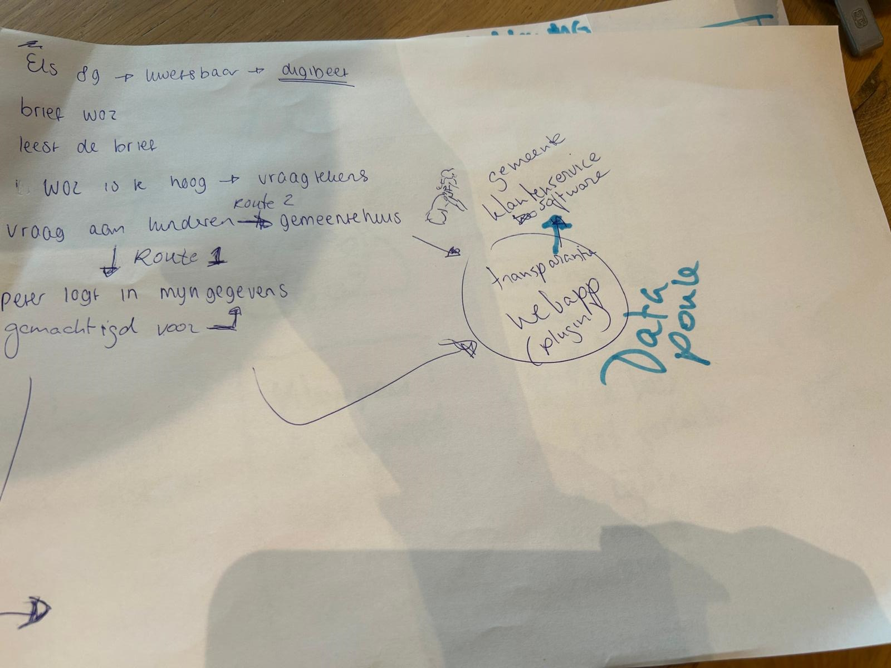
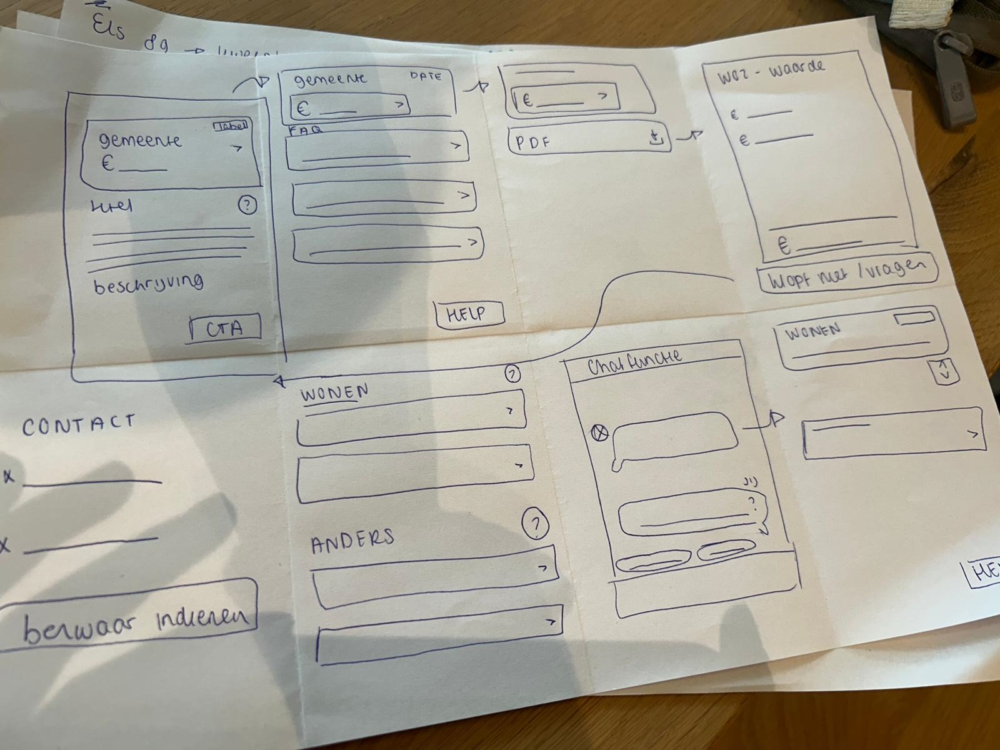
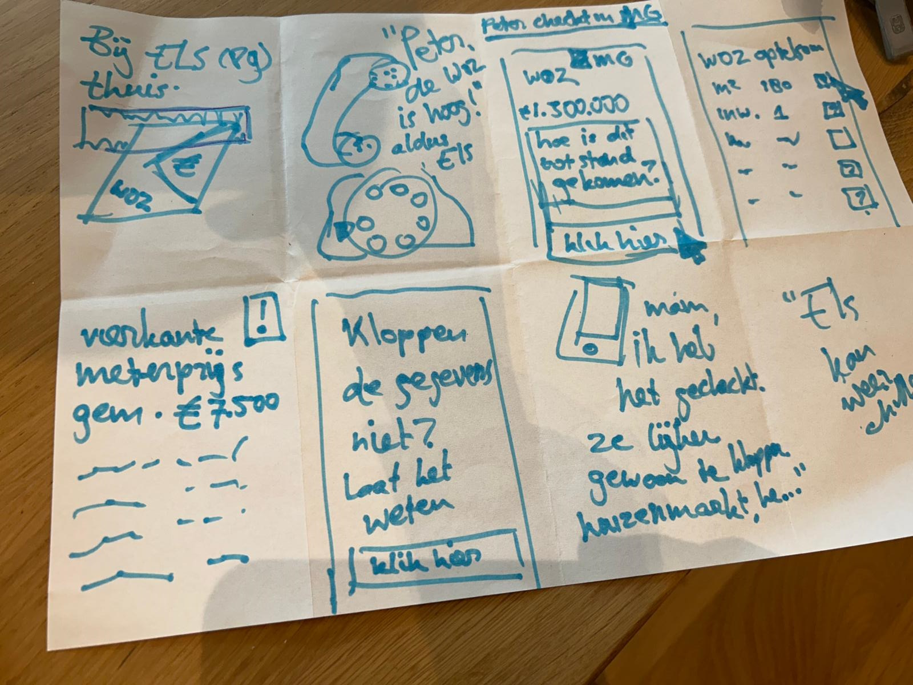

# Bijlagen

## Bijlage A: Uitgewerkte Persona’s

Voor uitleg van de scores, lees uitkomsten van vragenlijst.

**Fatima (28) – De controlerende burger**

Fatima is sterk geïnteresseerd in wat er met haar persoonsgegevens gebeurt. Ze maakt zich zorgen over hoe organisaties haar gegevens gebruiken en wil daarom vooral inzicht en controle.

Uit de analyse blijkt dat voor Fatima vooral functies belangrijk zijn die haar direct laten zien wie toegang heeft tot haar gegevens (*gemiddelde score 6,89*) en met welke organisaties haar gegevens zijn gedeeld (*gemiddelde score 6,89*). Deze hoge scores laten zien dat transparantie over datatoegang en data deling voor haar essentieel is.

Daarnaast vindt Fatima het zeer belangrijk dat zij haar gegevens kan controleren en corrigeren wanneer deze niet kloppen. De mogelijkheid om actie te ondernemen wanneer gegevens onjuist zijn, bijvoorbeeld door correctie of bezwaar, krijgt een gemiddelde score van *6,89*. Dit geeft aan dat controle over persoonlijke data voor haar een kernfunctie is.

Fatima is ook geïnteresseerd in meer inhoudelijke uitleg over datagebruik. Zo vindt zij het belangrijk om te begrijpen waarom haar gegevens worden gebruikt (*gemiddelde score 6,67*) en of haar gegevens invloed hebben gehad op een besluit (*gemiddelde score 6,56*). Transparantie gaat voor haar dus niet alleen over toegang tot data, maar ook over het begrijpen hoe beslissingen tot stand komen.

Meer technische functies, zoals het zien welke verwerkingen op haar gegevens zijn uitgevoerd (*gemiddelde score 6,33*) of een volledig overzicht van de route die haar gegevens door organisaties hebben afgelegd (*gemiddelde score 5,78*), zijn voor Fatima iets minder belangrijk.

Voor Fatima staat een transparantievoorziening vooral in het teken van **begrijpen, controleren en kunnen handelen wanneer dat nodig is**.

**Marc (54) – De geïnteresseerde maar praktische gebruiker**

Marc is geïnteresseerd in hoe zijn gegevens worden gebruikt, maar wil het vooral overzichtelijk en praktisch houden.

Hij vindt het belangrijk om te kunnen zien welke organisaties toegang hebben tot zijn gegevens (*gemiddelde score 6,7*) en met wie deze gegevens zijn gedeeld (*gemiddelde score 6,6*). Dit geeft hem een gevoel van controle zonder dat hij zich hoeft te verdiepen in complexe details.

Ook vindt Marc het belangrijk dat hij zijn gegevens kan controleren op juistheid (*gemiddelde score 6,5*) en dat hij actie kan ondernemen wanneer gegevens niet kloppen (*gemiddelde score 6,9*). Deze hoge score laat zien dat ook voor hem het kunnen corrigeren van gegevens een belangrijke functie is.

Hoewel Marc transparantie waardeert, wil hij niet te diep in technische details duiken. Functies zoals inzicht in welke verwerkingen op zijn gegevens zijn uitgevoerd (*gemiddelde score 5,8*) of een volledig overzicht van de route die gegevens tussen organisaties afleggen (*gemiddelde score 6,0*) zijn voor hem minder belangrijk dan een duidelijk en eenvoudig overzicht.

Voor Marc betekent transparantie vooral dat hij snel kan controleren of alles klopt en eenvoudig kan ingrijpen als dat nodig is, zonder zich te hoeven verdiepen in technische details.

**Peter (55) – De passieve gebruiker**

Peter denkt in het dagelijks leven nauwelijks na over zijn persoonsgegevens. Digitale diensten gebruikt hij vooral omdat ze handig zijn en hij staat zelden stil bij hoe zijn gegevens worden verwerkt. Toch vindt hij het belangrijk dat hij kan ingrijpen wanneer er iets misgaat.

Ook bij deze persona blijkt uit de data dat de mogelijkheid om actie te ondernemen bij onjuiste gegevens belangrijk is (*gemiddelde score 6,36*) en dat hij het belangrijk vindt om te kunnen zien welke organisaties toegang hebben tot zijn gegevens (*gemiddelde score 6,36*) en met welke organisaties gegevens zijn gedeeld (*gemiddelde score 6,18*).

Meer complexe functies, zoals inzicht in welke verwerkingen op gegevens zijn uitgevoerd (*gemiddelde score 4,9*) of een volledig overzicht van de route die gegevens tussen organisaties afleggen (*gemiddelde score 4,7*), zijn voor hem duidelijk minder belangrijk. Deze informatie voelt voor hem vaak te technisch of te uitgebreid.

Voor Peter is een transparantievoorziening vooral waardevol wanneer deze eenvoudig, duidelijk en probleemgericht is. Hij wil vooral weten dat hij geholpen wordt wanneer er iets misgaat, zonder actief op zoek te hoeven naar uitgebreide informatie.

**Els (90) – De kwetsbare burger**

**Let op:** Deze persona is niet direct gebaseerd op de uitgevoerde vragenlijst of gebruikerstesten. De persona is opgesteld op basis van inzichten uit literatuuronderzoek, toegankelijkheidsrichtlijnen en algemene ontwerpprincipes rondom inclusieve digitale dienstverlening.

Els heeft beperkte digitale vaardigheden en vindt het moeilijk om te begrijpen hoe haar gegevens worden gebruikt. Zij is sterk afhankelijk van overheidsorganisaties en digitale systemen, maar heeft vaak onvoldoende kennis of vertrouwen om complexe informatie zelfstandig te interpreteren.

Els heeft behoefte aan eenvoudige uitleg, duidelijke taal en stapsgewijze begeleiding. Wanneer informatie te uitgebreid, technisch of abstract wordt gepresenteerd, verliest zij het overzicht. Voor haar is het belangrijk dat informatie bevestigt dat alles correct verloopt en dat duidelijk wordt aangegeven wat zij moet doen wanneer er iets misgaat.

In tegenstelling tot de andere persona's heeft Els weinig behoefte aan diepgaande analyses van gegevensverwerkingen of besluitvorming. Zij wil vooral weten dat processen correct verlopen en dat zij ondersteuning kan krijgen wanneer dat nodig is.

Voor Els betekent grip niet het verkrijgen van meer informatie, maar het ervaren van duidelijkheid, zekerheid en begeleiding.

Belangrijkste behoeften die ze heeft zijn:

- Eenvoudige en begrijpelijke taal.

- Duidelijke navigatie en consistente interactiepatronen.

- Bevestiging dat processen correct verlopen.

- Ondersteuning bij het ondernemen van actie.

Ontwerpimplicaties

Hoewel deze doelgroep buiten de primaire scope van het onderzoek viel, benadrukt deze persona het belang van toegankelijkheid en inclusiviteit binnen de TransparantieApp. Ontwerpkeuzes zoals gelaagde informatie, samenvattingen, herkenbare navigatiepatronen en begrijpelijke taal dragen niet alleen bij aan de gebruikservaring van Els, maar verbeteren de toegankelijkheid voor alle gebruikers.

**Vergelijking van de persona's**

De verschillen tussen de persona's zitten voornamelijk in de mate waarin zij actief betrokken willen zijn bij het gebruik van hun persoonsgegevens en de hoeveelheid detail die zij wensen.

| **Persona**                      | **Houding**                                               | **Primaire behoefte**                                            | **Detailniveau**                 |
|----------------------------------|-----------------------------------------------------------|------------------------------------------------------------------|----------------------------------|
| Fatima | Actief betrokken                | Begrijpen, controleren en handelen     | Hoog   |
| Marc   | Geïnteresseerd maar pragmatisch | Overzicht en zekerheid                 | Middel |
| Peter  | Inactief totdat er iets misgaat | Probleem oplossen                      | Laag   |
| Els    | Voelt zich onzeker              | Ontzien worden en dingen geregeld zijn | Laag   |

**Gemeenschappelijke behoeften**

Opvallend is dat alle vier de persona's behoefte hebben aan dezelfde basisinformatie:

- Welke organisaties toegang hebben tot hun gegevens.

- Met welke organisaties gegevens zijn gedeeld.

- De mogelijkheid om gegevens te controleren.

- De mogelijkheid om fouten te corrigeren.

De verschillen ontstaan voornamelijk in de behoefte aan verdieping en technische details.

Deze bevinding ondersteunt de hypothese dat transparantie gelaagd moet worden aangeboden: een gemeenschappelijke basislaag kan voorzien in de informatiebehoefte van alle gebruikers, terwijl aanvullende detailniveaus ruimte bieden aan gebruikers die meer inzicht wensen in gegevensverwerkingen en besluitvorming.

## Bijlage B: Verslaglegging Co-creatie sessie

### Concept 1 – Waarom-knop & Transparantiecomponent

**Doel**

Gebruikers begrijpen waarom een besluit is genomen (bijvoorbeeld de WOZ-waarde) en kunnen vervolgens gericht handelen, zoals het controleren van gegevens of het maken van bezwaar.

**Probleem**

Gebruikers begrijpen vaak niet waarom hun WOZ-waarde zo hoog is. Ze vergelijken met buren, raken in verwarring en moeten zelf informatie zoeken op verschillende websites. De huidige situatie is versnipperd en biedt weinig context bij persoonlijke data.

Gekozen vragen :

-Hoe wordt mijn WOZ-waarde precies berekend?

-Waarom is mijn WOZ-waarde hoger/lager dan vorig jaar?

**Persona: Peter**

Peter ontvangt een gemeentelijke belasting en ziet zijn WOZ-waarde. Hij denkt dat deze te hoog is en gaat online zoeken. Hij vergelijkt met buren maar raakt in verwarring door gebrek aan duidelijke uitleg.

**User Journey**

Huidig:
- Brief ontvangen
- Zelf zoeken naar uitleg
- Versnipperde informatie
- Onbegrip en frustratie

Nieuw:
- Brief ontvangen
- Gaat naar WOZ-overzicht
- Ziet “Waarom?” knop
- Krijgt uitleg in context
- Kan begrijpen, controleren en bezwaar maken

**Oplossing**

Een gestandaardiseerd “Waarom”-component dat wordt toegevoegd aan bestaande overheidskanalen zoals MijnOverheid en WOZ-waardeloket.

**Opbouw van het component**

Niveau 1 – Snelle uitleg:
- Korte samenvatting in begrijpelijke taal
- Direct inzicht waarom de waarde zo is

Niveau 2 – Uitklapbare uitleg:
- Waarom?
- Hoe berekend?
- Welke gegevens gebruikt?

Niveau 3 – Detailpagina:
- Overzicht
- Data
- Berekening
- Inzicht in gebruikte gegevens en vergelijkingen

**Call-to-actions**

\- Bekijk details
- Maak bezwaar
- Dit klopt niet

**Ontwerpprincipes**

\- Context-first: informatie tonen waar gebruiker al is
- Persoonlijke uitleg i.p.v. generiek
- Gelaagde informatie (kort → detail)
- Herkenbare en consistente component
- Geschikt voor mobiel en desktop

**Aandachtspunten**

\- Balans tussen component en uitgebreide uitleg (systeemdenken)
- Uitleg moet concreet zijn (data, vergelijkingen)
- Emotie en onzekerheid van gebruiker erkennen

**Samenvatting**

Het concept transformeert een statisch besluit naar een uitlegbaar systeem. Gebruikers zien niet alleen wat ze moeten betalen, maar ook waarom en hoe ze dit kunnen controleren of aanvechten.

**Prototypes**

  

  

  

  

### Concept 2 – Hulp & Begeleiding (Els)

**Doel**

Gebruikers die moeite hebben met het begrijpen van overheidsinformatie ondersteunen bij het begrijpen, het krijgen van hulp en het ondernemen van de juiste acties.

**Probleem**

Gebruikers zoals Els begrijpen de informatie in brieven en digitale omgevingen niet goed. Ze raken onzeker, weten niet waar ze moeten beginnen en hebben hulp nodig van anderen of de gemeente.

**Persona: Els**

Els is minder digitaal vaardig en voelt zich onzeker bij overheidsinformatie. Ze vraagt hulp aan familie of gaat naar de gemeente.

**User Journey**

Huidig:
- Ontvangt brief
- Begrijpt het niet
- Vraagt hulp of gaat naar gemeente

Nieuw:
- Ontvangt brief
- Gaat naar MijnOverheid / WOZ
- Ziet “Hulp nodig?” optie
- Krijgt begeleiding en hulpopties
- Kan hulp inschakelen of actie ondernemen

**Oplossing**

Een geïntegreerde hulp- en begeleidingscomponent binnen bestaande overheidsplatformen die gebruikers ondersteunt bij het begrijpen en handelen.

**Hulpcomponent**

Wordt geplaatst naast de “Waarom?” knop:
\[ Waarom? \] \[ Hulp nodig? \]

**FAQ & Chatbot integratie**

De UI bevat voorgestelde vragen die gelijk zijn aan de vragen in een chatbot. Gebruikers kunnen direct klikken op herkenbare vragen zoals:
- “Waarom is mijn WOZ zo hoog?”
- “Kloppen mijn gegevens?”
- “Hoe maak ik bezwaar?”

Deze vragen werken zowel als FAQ (klikbare opties) als input voor een chatbot, waardoor de ervaring consistent en herkenbaar blijft.

**Ontwerpprincipes**

\- Begeleiding in plaats van alleen informatie
- Emotie en onzekerheid erkennen
- Beperkt aantal keuzes (max 3–4)
- Toegankelijke taal (geen jargon zoals “machtiging”)
- Ondersteuning van meerdere routes (zelf, hulp van anderen, gemeente)

**Samenvatting**

Dit concept richt zich op gebruikers die ondersteuning nodig hebben. Het combineert uitleg, begeleiding en hulp van anderen binnen één geïntegreerde ervaring. Door FAQ en chatbot-functionaliteit te combineren ontstaat een consistente en toegankelijke manier van interactie.

**Prototypes**

  

  

  

  

**LINK NAAR FINAL PROTOTYPE:**

[<u>https://carve-bagel-18994557.figma.site</u>](https://carve-bagel-18994557.figma.site)

## Bijlage C: Testscripts

Testscript-WOZ app getest

### **Doel van de gebruikerstest**

Deze gebruikerstest is uitgevoerd om te onderzoeken of gebruikers zelfstandig hun weg kunnen vinden in de WOZ-app en begrijpen welke informatie de app geeft over de totstandkoming van hun WOZ-waarde.

Daarbij is specifiek gekeken naar:

- de eerste indruk en het begrip van het doel van de app;

- de vindbaarheid van informatie;

- de begrijpelijkheid van de navigatie;

- het begrip van de WOZ-waardebepaling;

- het begrip van de gegevensuitwisseling;

- de begrijpelijkheid van gebruikte termen en afkortingen;

- gewaardeerde en ontbrekende functionaliteiten.

### **Hoofdvraag**

**In hoeverre kunnen gebruikers zelfstandig de relevante informatie over hun WOZ-waardebepaling vinden en begrijpen, en ondersteunt de app hen hierin op een duidelijke en begrijpelijke manier?**

De hoofdvraag richt zich daarmee op twee centrale UX-aspecten:

**Vindbaarheid**
Kunnen gebruikers zelfstandig navigeren naar de informatie die zij zoeken?

**Begrijpelijkheid**
Begrijpen gebruikers de informatie, terminologie en visualisaties wanneer zij deze hebben gevonden?

### **Deelnemers**

De gebruikerstest is uitgevoerd met **10 deelnemers uit Nederland**. De deelnemers verschilden onder andere in leeftijd, geslacht, opleidingsniveau, werkstatus en online ervaring.

De technische vaardigheid van de deelnemers was relatief hoog: 8 deelnemers werden als gevorderd en 2 als gemiddeld technisch vaardig geclassificeerd.

### **Testmethode**

De deelnemers doorliepen zelfstandig een interactief prototype van de WOZ-app. Tijdens de test werd gebruikgemaakt van de **think-aloud methode:** deelnemers werden gevraagd hardop te vertellen wat zij zagen, wat zij verwachtten en waarom zij bepaalde keuzes maakten.

Naast de kwalitatieve observaties is gebruikgemaakt van **task completion** om te beoordelen in hoeverre deelnemers de belangrijkste taken zelfstandig konden uitvoeren. Task completion is een usability metric waarmee wordt vastgesteld of een gebruiker het beoogde doel van een taak weet te bereiken.

Voor de analyse zijn de volgende niveaus gehanteerd:

- **Volledig succesvol** – De deelnemer bereikt zelfstandig het juiste einddoel van de taak, zonder relevante problemen.

- **Succesvol met een klein probleem** – De deelnemer bereikt het juiste einddoel, maar ervaart een klein probleem, maakt een beperkte omweg of toont enige twijfel.

- **Succesvol met een groot probleem** – De deelnemer bereikt uiteindelijk het doel, maar ondervindt daarbij duidelijke problemen, maakt een grote omweg of interpreteert een belangrijk onderdeel verkeerd.

- **Niet succesvol** – De deelnemer bereikt het beoogde einddoel van de taak niet.

Deze indeling is gebaseerd op de *levels of success* zoals beschreven door Nielsen Norman Group. Daarbij worden de categorieën afzonderlijk gerapporteerd en niet omgerekend naar één gemiddelde numerieke score, omdat de categorieën een ordinale schaal vormen.

#### **Toepassing binnen deze gebruikerstest**

Task completion is met name gebruikt bij taken waarbij de deelnemer zelfstandig een concreet doel moet bereiken, zoals het bereiken van het home scherm en het vinden van informatie over de WOZ-waardebepaling.

Het succespercentage (success rate) wordt gehanteerd als de primaire metriek om de effectiviteit van de testtaken te meten, waarbij de resultaten worden geclassificeerd volgens de richtlijnen van de Nielsen Norman Group.

Bij meer verkennende taken, zoals het interpreteren van het navigatiemenu of het uitleggen van de gegevensuitwisseling, ligt de nadruk op kwalitatieve analyse van begrip, verwachtingen en ervaren duidelijkheid.

### **Testtaken**

#### Taak 1 – Eerste indruk

**Doel**

Onderzoeken of gebruikers op basis van de eerste pagina begrijpen wat het doel van de app is.

**Instructie aan deelnemer**

Dit is de eerste pagina die u ziet. Neem even rustig de tijd. Wat denkt u dat het doel is van deze app? Vertel dit in uw eigen woorden.

**Observatiepunten**

- Wat valt de deelnemer als eerste op?

- Hoe omschrijft de deelnemer het doel van de app?

- Komt dit overeen met het bedoelde doel?

- Welke verwachtingen heeft de deelnemer van de app?

- Welke elementen zorgen eventueel voor verwarring?

**Indicatieve tijd:** 1–2 minuten. De gemiddelde taakduur was circa 1 minuut en 15 seconden.

#### Taak 2 – Inloggen en het homescherm bereiken

**Doel**

Onderzoeken of gebruikers zelfstandig kunnen inloggen en begrijpen hoe zij het hoofdscherm van de app bereiken.

**Scenario**

De deelnemer heeft een brief ontvangen van de gemeente Amsterdam over de WOZ-waarde en wil meer informatie over het gegevensproces.

**Instructie aan deelnemer**

U heeft een brief ontvangen van de gemeente Amsterdam over uw WOZ-waarde en wilt meer informatie over het gegevensproces. Denk hardop terwijl u de stappen doorloopt. Vertel wat u ziet op het scherm en wat u denkt dat er van u wordt verwacht.

1.  Open de app en log in.

2.  U hoeft geen echte gegevens in te voeren. Elke invoer wordt geaccepteerd.

3.  Verschijnt er een pop-upvenster met de vraag of u het wachtwoord wilt opslaan? Klik dan op ‘Nee’.

4.  Ga door totdat u het home scherm ziet.

**Observatiepunten**

- Is duidelijk waar de deelnemer moet inloggen?

- Begrijpt de deelnemer wat er moet worden ingevuld?

- Kan de deelnemer zelfstandig verder?

- Herkent de deelnemer het home scherm?

- Waar ontstaat twijfel of vertraging?

**Indicatieve tijd:** 1–2 minuten. De gemiddelde taakduur was circa 1 minuut en 30 seconden.

#### Taak 3 – Begrip van de navigatie

**Doel**

Onderzoeken of de navigatiestructuur en benaming van de verschillende onderdelen aansluiten bij de verwachtingen van gebruikers.

**Instructie aan deelnemer**

Kijk naar het navigatiemenu. Vertel kort hardop per knop wat u verwacht te zien wanneer u op deze knop klikt.

**Observatiepunten**

- Wat verwacht de deelnemer achter ieder navigatie-item?

- Sluiten de labels aan bij deze verwachtingen?

- Welke labels zijn direct duidelijk?

- Welke labels zijn dubbelzinnig of onduidelijk?

- Verwacht de deelnemer bepaalde informatie op een andere plek?

**Indicatieve tijd:** 1–2 minuten. De gemiddelde taakduur was circa 1 minuut en 8 seconden.

#### Taak 4 – Informatie over de WOZ-waardebepaling vinden

**Doel**

Onderzoeken of gebruikers zelfstandig kunnen vinden welke gegevens zijn gebruikt voor het bepalen van hun WOZ-waarde. Deze taak richt zich direct op het onderdeel vindbaarheid van de hoofdvraag.

**Scenario**

De deelnemer heeft een brief ontvangen van de gemeente Amsterdam over de WOZ-waarde en wil weten welke gegevens de gemeente heeft gebruikt om deze waarde te bepalen.

**Instructie aan deelnemer**

U heeft een brief ontvangen van de gemeente Amsterdam over uw WOZ-waarde en u wilt weten welke gegevens de gemeente heeft gebruikt om deze waarde te bepalen. Ga op zoek naar deze informatie. Vertel hardop op welke pagina u verwacht deze informatie te kunnen vinden.

**Observatiepunten**

- Waar zoekt de deelnemer als eerste?

- Welke navigatie route wordt gevolgd?

- Welk onderdeel verwacht de deelnemer nodig te hebben?

- Wordt de informatie zelfstandig gevonden?

- Zijn er verkeerde routes of momenten van twijfel?

- Is duidelijk wanneer de juiste informatie is gevonden?

**Indicatieve tijd:** 1–2 minuten. De gemiddelde taakduur was circa 56 seconden.

#### Taak 5 – Begrip van gegevensuitwisseling

**Doel**

Onderzoeken of gebruikers begrijpen wat het overzicht van gegevensuitwisseling laat zien. Deze taak richt zich voornamelijk op het onderdeel begrijpelijkheid van de hoofdvraag.

**Startpunt**

WOZ-dossier → tabblad **Gegevensuitwisseling**.

**Instructie aan deelnemer**

U bent nu bij het WOZ-dossier. Bekijk de tab ‘Gegevensuitwisseling’. Wat laat dit overzicht volgens u zien? Vertel hardop.

**Observatiepunten**

- Begrijpt de deelnemer wat het overzicht als geheel laat zien?

- Begrijpt de deelnemer de verschillende stappen?

- Is duidelijk welke partijen betrokken zijn?

- Is duidelijk welke gegevens worden gebruikt of uitgewisseld?

- Begrijpt de deelnemer waarom gegevens worden uitgewisseld?

- Zijn iconen en labels begrijpelijk?

- Zijn toelichtingen begrijpelijk?

- Is het detailniveau passend of overweldigend?

**Follow-up vragen**

**1. Wat vindt u duidelijk aan dit scherm?**

**2. Wat vindt u onduidelijk aan dit scherm?**

**Indicatieve tijd:** 1–2 minuten voor de hoofdtaak. De gemiddelde taakduur was circa 1 minuut en 23 seconden.

### 6\. Afsluitende vragen

Na de taakgerichte onderdelen kregen deelnemers drie algemene vragen over hun ervaring met de app.

#### Vraag 1 – Terminologie

Waren er termen in de app onduidelijk? Zo ja, welke?

**Doel**

Achterhalen welke vaktermen, afkortingen of formuleringen aanvullende uitleg nodig hebben.

#### Vraag 2 – Waardevolle functionaliteiten

Welke functies waardeert u het meest in de app?

**Doel**

Achterhalen welke informatie en functionaliteiten voor gebruikers de meeste toegevoegde waarde hebben.

#### Vraag 3 – Ontbrekende functionaliteiten

Welke functies of opties mist u in de test of in de app?

**Doel**

Achterhalen welke informatie of functionaliteit gebruikers verwachten, maar nog niet terugvinden in het prototype.

*Deze drie vragen komen overeen met de afsluitende surveyvragen uit de uitgevoerde test.*

### **Analysecriteria**

De resultaten zijn geanalyseerd aan de hand van drie dimensies: task completion, vindbaarheid en begrijpelijkheid.

**Task completion**

Per relevante taak is vastgesteld in welke mate de deelnemer het beoogde doel heeft bereikt:

**Volledig succesvol**
De deelnemer bereikt het juiste doel zelfstandig en zonder relevante problemen.

**Succesvol met een klein probleem**
De deelnemer bereikt het doel, maar ervaart lichte twijfel, maakt een kleine omweg of ondervindt een beperkt usability probleem.

**Succesvol met een groot probleem**
De deelnemer bereikt het doel, maar ervaart aanzienlijke problemen, maakt een grote omweg of heeft duidelijk moeite om de juiste route of informatie te begrijpen.

**Niet succesvol**
De deelnemer bereikt het beoogde doel niet.

**Vindbaarheid**

Naast het uiteindelijke taak resultaat is onderzocht:

- welke route de deelnemer volgt;

- waar twijfel ontstaat;

- welke verkeerde afslagen worden genomen;

- of de juiste informatie zelfstandig wordt gevonden;

- hoe lang het duurt om de informatie te vinden.

**Begrijpelijkheid**

Vervolgens is onderzocht:

- of deelnemers begrijpen wat de gevonden informatie betekent;

- of labels en navigatie-items aansluiten bij hun verwachtingen;

- of termen en afkortingen worden begrepen;

- of deelnemers de gegevensuitwisseling correct kunnen interpreteren;

- of deelnemers in eigen woorden kunnen uitleggen wat er op het scherm gebeurt.

Door task completion te combineren met observaties en think-aloud-data wordt niet alleen zichtbaar **óf** gebruikers hun doel bereiken, maar ook **waarom** dit wel of niet lukt.

## Bijlage D: Vragenlijst Datatransparantie

### Onderzoeksopzet

Voor het UX-onderzoek naar datatransparantie is een online vragenlijst afgenomen onder deelnemers uit Nederland. De vragenlijst richtte zich op het belang van verschillende vormen van inzicht in persoonsgegevens, gewenste functionaliteiten binnen een transparantie-app en de houding van deelnemers tegenover het gebruik van persoonsgegevens door organisaties.

### Vragenlijst

**Vraag 1**

**Hoe belangrijk vindt u het om te kunnen zien welke persoonsgegevens organisaties over u hebben opgeslagen?**

Schaal: 1 – Helemaal niet belangrijk tot 7 – Zeer belangrijk

**Vraag 2**

**Hoe belangrijk vindt u het om te kunnen zien waar uw gegevens vandaan komen (bijvoorbeeld van uzelf, een gemeente of een andere organisatie)?**

Schaal: 1 – Helemaal niet belangrijk tot 7 – Zeer belangrijk

**Vraag 3**

**Hoe belangrijk vindt u het om te kunnen zien welke organisaties uw gegevens hebben bekeken?**

Schaal: 1 – Helemaal niet belangrijk tot 7 – Zeer belangrijk

**Vraag 4**

**Hoe belangrijk vindt u het om te kunnen zien met welke organisaties uw gegevens zijn gedeeld?**

Schaal: 1 – Helemaal niet belangrijk tot 7 – Zeer belangrijk

**Vraag 5**

**Hoe belangrijk vindt u het om te kunnen zien waarom uw gegevens worden gebruikt?**

Schaal: 1 – Helemaal niet belangrijk tot 7 – Zeer belangrijk

**Vraag 6**

**Hoe belangrijk vindt u het om te kunnen zien of een algoritme is gebruikt bij het verwerken van uw gegevens?**

Schaal: 1 – Helemaal niet belangrijk tot 7 – Zeer belangrijk

**Vraag 7**

**Hoe belangrijk vindt u het om te kunnen zien of uw gegevens invloed hebben gehad op een besluit over u (bijvoorbeeld bij een aanvraag of beoordeling)?**

Schaal: 1 – Helemaal niet belangrijk tot 7 – Zeer belangrijk

**Vraag 8**

**Hoe belangrijk vindt u het om te kunnen controleren of uw gegevens correct zijn?**

Schaal: 1 – Helemaal niet belangrijk tot 7 – Zeer belangrijk

**Vraag 9**

**Hoe belangrijk vindt u het om actie te kunnen ondernemen als uw gegevens onjuist zijn (bijvoorbeeld corrigeren of bezwaar maken)?**

Schaal: 1 – Helemaal niet belangrijk tot 7 – Zeer belangrijk

**Vraag 10**

**Hoe belangrijk vindt u het om te kunnen zien welke verwerkingen op uw gegevens zijn uitgevoerd (bijvoorbeeld analyse, samenvoegen of berekeningen)?**

Schaal: 1 – Helemaal niet belangrijk tot 7 – Zeer belangrijk

**Vraag 11**

**Hoe belangrijk vindt u het om te kunnen zien hoe lang organisaties uw persoonsgegevens bewaren?**

Schaal: 1 – Helemaal niet belangrijk tot 7 – Zeer belangrijk

**Vraag 12**

**Hoe belangrijk vindt u het om te kunnen zien welke organisatie verantwoordelijk is voor uw gegevens?**

Schaal: 1 – Helemaal niet belangrijk tot 7 – Zeer belangrijk

**Vraag 13**

**Hoe belangrijk vindt u het om te kunnen zien wanneer uw gegevens voor het laatst zijn bijgewerkt?**

Schaal: 1 – Helemaal niet belangrijk tot 7 – Zeer belangrijk

**Vraag 14**

**Hoe belangrijk vindt u het om te kunnen zien welke organisaties toegang hebben tot uw gegevens?**

Schaal: 1 – Helemaal niet belangrijk tot 7 – Zeer belangrijk

**Vraag 15**

**Hoe belangrijk vindt u het om een overzicht te zien van de volledige route die uw gegevens door organisaties hebben afgelegd?**

Schaal: 1 – Helemaal niet belangrijk tot 7 – Zeer belangrijk

**Vraag 16**

**Welke drie functies vindt u het belangrijkst in een transparantie-app?**

Meerdere antwoorden mogelijk, maximaal drie.

- Inzicht in welke gegevens over mij bestaan

- Inzicht in met wie mijn gegevens zijn gedeeld

- Inzicht in wie mijn gegevens heeft bekeken

- Inzicht in waarom mijn gegevens worden gebruikt

- Controleren of mijn gegevens correct zijn

- Mogelijkheid om gegevens te corrigeren of bezwaar te maken

- Inzicht in waar mijn gegevens vandaan komen

- Inzicht of mijn gegevens invloed hadden op een besluit

- Inzicht in hoe lang mijn persoonsgegevens worden bewaard

- Inzicht in welke organisatie verantwoordelijk is voor mijn gegevens

- Inzicht of een algoritme is gebruikt

- Inzicht in welke verwerkingen met mijn gegevens zijn uitgevoerd, bijvoorbeeld analyse, samenvoegen of berekeningen

- Inzicht in wanneer mijn gegevens voor het laatst zijn bijgewerkt

- Inzicht in de volledige route die mijn gegevens door verschillende organisaties hebben afgelegd

- Anders

**Vraag 17**

**In hoeverre maakt u zich zorgen over hoe organisaties uw persoonsgegevens gebruiken?**

Antwoordmogelijkheden:

- Helemaal niet

- Weinig

- Neutraal

- Redelijk

- Volledig

**Vraag 18**

**In hoeverre vertrouwt u dat organisaties zorgvuldig omgaan met uw persoonsgegevens?**

Antwoordmogelijkheden:

- Helemaal niet

- Weinig

- Neutraal

- Redelijk

- Volledig

**Vraag 19**

**Zou u een app gebruiken die inzicht geeft in hoe uw persoonsgegevens worden gebruikt?**

Antwoordmogelijkheden:

- Ja, zeker

- Misschien

- Waarschijnlijk niet

- Nee

## Bijlage E: Experience Map

Deze experience map beschrijft hoe mensen de verwerking en uitwisseling van persoonsgegevens ervaren gedurende hun interactie met organisaties. De kaart laat zien dat gegevensverwerking in de meeste situaties onzichtbaar en probleemloos verloopt. Pas wanneer er iets onverwachts gebeurt, ontstaat de behoefte aan inzicht, uitleg en handelingsperspectief.

De experience map bestaat uit twee delen. Het eerste deel beschrijft de normale gebruikerservaring: van een verwachting waarmee iemand een proces start, via de onzichtbare verwerking van gegevens, naar een voorspelbaar resultaat. Het tweede deel richt zich op de situatie waarin deze verwachting wordt doorbroken. De gebruiker ervaart een verstoring, zoekt naar een verklaring, wil begrijpen wat er is gebeurd en zoekt mogelijkheden om invloed uit te oefenen. Uiteindelijk kan opnieuw vertrouwen ontstaan wanneer voldoende transparantie, context en handelingsperspectief worden geboden.

Onder iedere experience map staat een ontwerpanalyse. Deze analyse vertaalt de observaties uit de gebruikerservaring naar ontwerpinzichten. Per fase worden de onderliggende behoeften, risico's en ontwerpkansen benoemd.

### Deel 1: Gebruikerservaring

| **Fase**            | **1. Verwachting**             | **2. Verwerking**               | **3. Normaal verloop**        |
|---------------------|--------------------------------|---------------------------------|-------------------------------|
| **Wat gebeurt er?** | Persoon wilt iets bereiken     | Organisaties verwerken gegevens | Alles verloopt zoals verwacht |
| **Gebruikersdoel**  | Taak afronden                  | Geen actief doel                | Resultaat ontvangen           |
| **Gedachten**       | "Dit zal wel geregeld worden." | "Dat gebeurt automatisch."      | "Prima."                      |
| **Emoties**         | Vertrouwend                    | Onbezorgd                       | Tevreden                      |
| **Vragen**          | Wat moet ik doen?              | Geen                            | Geen                          |

#### Ontwerpanalyse

| **Analyse**  | **1. Verwachting** | **2. Verwerking**      | **3. Normaal verloop** |
|--------------|--------------------|------------------------|------------------------|
| **Behoefte** | Gemak              | Vertrouwen             | Voorspelbaarheid       |
| **Risico**   | Complexiteit       | Onzichtbaarheid        | Onverschilligheid      |
| **Kans**     | Duidelijke start   | Transparante processen | Frictieloze ervaring   |

### Deel 2: Van verstoring naar vertrouwen

| **Fase**            | **4. Verstoring**                                            | **5. Begrijpen**       | **6. Handelen**                | **7. Vertrouwen**       |
|---------------------|--------------------------------------------------------------|------------------------|--------------------------------|-------------------------|
| **Wat gebeurt er?** | Er gebeurt iets onverwachts                                  | Persoon zoekt uitleg   | Persoon wil invloed uitoefenen | Nieuwe balans ontstaat  |
| **Gebruikersdoel**  | Begrijpen wat er gebeurt                                     | Oorzaak achterhalen    | Probleem oplossen              | Zekerheid krijgen       |
| **Gedachten**       | "Huh? Waarom gebeurt dit? Welke gegevens zijn hier gedeeld?" | "Hoe zit dit precies?" | "Wat kan ik nu doen?"          | "Oké, ik snap het."     |
| **Emoties**         | Onzeker                                                      | Onderzoekend           | Doelgericht                    | Gerustgesteld           |
| **Vragen**          | Waarom gebeurt dit? Welke gegevens zijn gedeeld?             | Wie? Waarom? Hoe?      | Welke opties heb ik?           | Kan ik erop vertrouwen? |

#### Ontwerpanalyse

| **Analyse**  | **4. Verstoring**   | **5. Begrijpen**     | **6. Handelen**       | **7. Vertrouwen**     |
|--------------|---------------------|----------------------|-----------------------|-----------------------|
| **Behoefte** | Verklaring          | Context              | Handelingsperspectief | Zekerheid             |
| **Risico**   | Verwarring          | Informatie-overload  | Machteloosheid        | Wantrouwen            |
| **Kans**     | Tijdige signalering | Begrijpelijke uitleg | Actie mogelijk maken  | Vertrouwen versterken |

