# Resultaten

Dit hoofdstuk presenteert de resultaten van het uitgevoerde gebruikersonderzoek, gestructureerd volgens de iteratieve ontwerpaanpak die in het vorige hoofdstuk is beschreven. Het onderzoek is opgedeeld in drie iteratie cycli, waarbij per cyclus specifieke inzichten uit literatuuronderzoek, gesprekken met stakeholders, bruikbaarheidstesten, en co-creatie sessies zijn verzameld.

In de volgende secties worden de bevindingen per iteratie toegelicht:

3.1 Eerste iteratie: Richt zich op de verkennende fase (Ideate) en de initiële behoefteanalyse, inclusief inzichten uit expertinterviews en bestudering van referentie-applicaties zoals de VO-Rijk app.

3.2 Tweede iteratie: Belicht de fase van verfijning en validatie, met een focus op de kwantitatieve A/B-testresultaten en kwalitatieve analyses van het prototype.

3.3 Derde iteratie: Bespreekt de uitkomsten van de laatste validatietesten, waaronder het onderzoek onder oudere gebruikers, en vertaalt deze naar concrete implicaties voor het ontwerp en de informatiearchitectuur van de TransparantieApp.

## Eerste iteratie

### Verkenning en Ideevorming (Ideate)

De initiële fase van het project richtte zich op het vaststellen van de technische en organisatorische kaders. Uit diepgaande gesprekken met softwareontwikkelaar Henk-Erik en het bredere projectteam, kwam naar voren dat de bestaande simulaties binnen Digilab een robuust fundament bieden voor de TransparantieApp. Er is reeds waardevolle data beschikbaar over gegevensuitwisseling en processtappen, wat direct hergebruik mogelijk maakt.

In deze technische context is de doelstelling geconcretiseerd: de focus ligt specifiek op het inzichtelijk maken van de totstandkoming van besluiten. Om de complexiteit beheersbaar te houden, is besloten om andere AVG-rechten, zoals bezwaarprocedures, in dit stadium buiten beschouwing te laten.

Parallel aan de technische inventarisatie is de juridische en maatschappelijke context verkend. Gesprekken met Sabine Geerdes en Elske Derks onderstreepten dat de AVG zich primair richt op persoonsgegevens, terwijl er weinig eisen zijn voor transparantie over de besluitvorming zelf. De TransparantieApp ambieert deze kloof te dichten. Literatuuronderzoek bevestigt dat burgers momenteel kampen met een versnipperd landschap van privacytools en een zwakke informatiepositie door een gebrek aan inzicht in de 'waarom-vraag'. De behoefte aan transparantie blijkt bovendien situationeel en ontstaat vaak pas bij negatieve uitkomsten. Dit benadrukt de noodzaak voor een ontwerp dat verder gaat dan de minimale wettelijke kaders en aansluit bij de werkelijke klantreis van de burger.

#### **Case Study: Vorderingenoverzicht Rijk (VO-Rijk) app**

Als referentiekader is de VO-Rijk app geanalyseerd, een koploper in digitale transparantie. De kracht van deze app ligt in de veilige DigiD-activatie flow en de strikte scheiding tussen de lokale beveiliging (pincode) en de centrale authenticatie. De UX-architectuur is opgebouwd rond twee pijlers: 'Overzicht' voor directe acties en 'Dossiers' voor inhoudelijke volledigheid. Deze methode van 'uitkleden', waarbij alleen functionele componenten overblijven die waarde toevoegen, dient als blauwdruk. De visie dat de burger niet hoeft te reizen naar de informatie, maar dat de informatie naar de burger komt, vormt het leidende principe voor de integratie van transparantie-informatie in de bredere overheidsdienstverlening.

### Definitie en Vereisten (Define)

De vertaling van wat burgers nodig hebben naar hoe de app eruit ziet, is de kern van deze fase. Uit ons onderzoek blijkt dat er drie verschillende groepen gebruikers zijn, die elk op hun eigen manier met transparantie omgaan. Voor elk van hen vraagt dit om specifieke keuzes in het ontwerp:

- **De 'Inzagezoeker' (Actief):** Deze gebruikers willen volledige controle en diepgang. Zij willen tot de bodem kunnen uitzoeken hoe een besluit tot stand is gekomen. Het ontwerp moet voor hen een manier bieden om diep in de data te graven zonder de weg kwijt te raken in de complexiteit. De app helpt hen om logische stappen en ketenrelaties te volgen op een manier die helder en overzichtelijk blijft.

- **De 'Pragmatische burger' (Vertrouwend):** Deze gebruikers willen vooral weten of alles goed geregeld is. Voor hen moet de app zich zo veel mogelijk op de achtergrond houden. Zij hebben behoefte aan een overzichtelijk dashboard dat alleen een seintje geeft als er echt actie nodig is of als er iets afwijkt van de norm. Zo voorkomen we dat deze groep wordt overspoeld met informatie die voor hen op dat moment niet relevant is.

- **De 'Kwetsbare burger' (Heeft ondersteuning nodig):** Deze doelgroep stelt de hoogste eisen aan eenvoud en begrijpelijkheid. Het ontwerp moet voor hen extra toegankelijk zijn. Dit betekent: geen ingewikkeld jargon, maar heldere en menselijke taal die aansluit bij hun dagelijkse belevingswereld. De interface moet voor hen voor zichzelf spreken en hen ondersteunen bij elke stap, zodat zij niet hoeven te gissen wat een knop of term betekent.

Deze inzichten leiden tot een belangrijke kernhypothese: transparantie moet gelaagd en situationeel zijn. Informatie is alleen waardevol als deze op het juiste moment en in de juiste hoeveelheid wordt aangeboden. De uitdaging voor het ontwerp is om complexe data en besluitvorming dusdanig te presenteren dat het aansluit bij de verschillende behoeften en 'denkwerelden' van de burger.

Een volledige uitwerking van de gebruikte persona's is opgenomen in Bijlage A.

### UX-patronen voor hiërarchische data

Het inzichtelijk maken van complexe overheidsdata vraagt om een doordachte vertaalslag naar de gebruikersinterface. Omdat de TransparantieApp werkt met gelaagde en technisch complexe datasets, is het cruciaal om bestaande UX-patronen in te zetten die de cognitieve belasting beperken. In de volgende sectie bespreken we welke patronen zijn onderzocht en toegepast om deze hiërarchische data toegankelijk en begrijpelijk te maken voor de eindgebruiker.

Om de complexe en gelaagde aard van overheidsdata toegankelijk te maken, is er in deze fase gefocust op de inzet van specifieke UX-patronen. De uitdaging hierbij is om de informatiearchitectuur dusdanig in te richten dat gebruikers de relevante context van besluitvormingsprocessen begrijpen, zonder te worden overweldigd door de technische diepgang van de onderliggende datasets. In de volgende secties worden de UX-patronen geanalyseerd die zijn geselecteerd om de cognitieve belasting te verlagen en de hiërarchische data inzichtelijk en bruikbaar te presenteren voor de burger.

Om deze complexiteit begrijpelijk te maken en de mentale belasting voor de gebruiker aanzienlijk te verminderen, is onderzocht welke bestaande UX-patronen en ontwerpprincipes geschikt zijn voor het structureren en visualiseren van dit type data.

**Progressive disclosure**

Een belangrijk uitgangspunt binnen dit onderzoek is het principe van *progressive disclosure* (Nielsen Norman Group, z.d.), waarbij informatie stapsgewijs wordt aangeboden. In plaats van alle data in één keer te tonen, krijgen gebruikers eerst een overzicht te zien, waarna zij zelf kunnen kiezen om verder de diepte in te gaan. Dit helpt om cognitieve belasting te verminderen en voorkomt dat gebruikers overweldigd raken door de hoeveelheid informatie.

Dit principe wordt veel toegepast in bestaande digitale producten. Zo laten e-maildiensten zoals Gmail eerst alleen een lijst met berichten zien, waarbij de inhoud pas zichtbaar wordt na het openen van een e-mail. Ook in apps zoals MijnOverheid of bankier-apps wordt eerst een samenvatting getoond, zoals een overzicht van transacties of meldingen, waarna gebruikers kunnen doorklikken naar details per item. In e-commerce omgevingen, zoals webshops, wordt progressive disclosure toegepast via filters en uitklapbare productinformatie, waarbij technische specificaties pas zichtbaar worden wanneer de gebruiker hier expliciet naar zoekt.

<figure>
  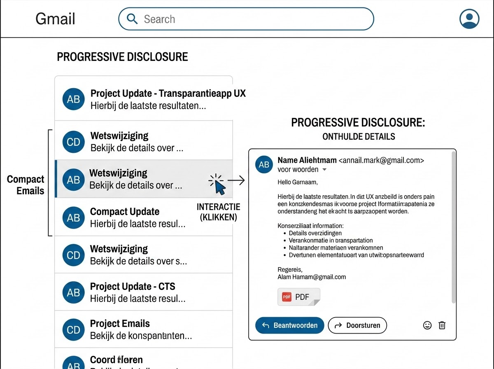
  <figcaption>Gmail-interface als voorbeeld van progressive disclosure</figcaption>
</figure>

**Radial en edgeless tree structuren**

Een belangrijk patroon is het gebruik van radial- en edgeless tree-structuren, waarbij informatie wordt weergegeven als een vertakkend netwerk vanuit een centraal punt. Gebruikers kunnen hierbij navigeren tussen verschillende niveaus, terwijl de context van de totale structuur behouden blijft.

Dit soort structuren zijn herkenbaar in bestandssystemen zoals Google Drive, waar mappen en submappen hiërarchisch zijn opgebouwd, en in kennisplatforms zoals GitHub, waar gebruikers door repositories en onderliggende bestanden navigeren. Ook platforms zoals Spotify en Netflix maken gebruik van vergelijkbare structuren, waarin content via categorieën en subcategorieën wordt verkend. Deze aanpak helpt gebruikers om complexe relaties inzichtelijk te maken zonder het overzicht te verliezen.

**Timeline- en inboxpatronen**

Daarnaast sluiten timeline- en inboxpatronen goed aan bij het gedrag van gebruikers. In deze patronen wordt informatie chronologisch gepresenteerd, vaak met de meest recente gebeurtenissen bovenaan.

<figure>
  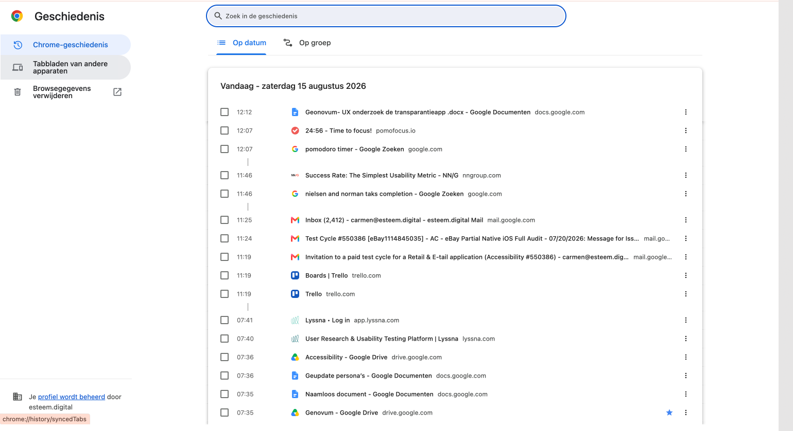
  <figcaption>Voorbeeld van een oneindige tijdlijn (infinite scroll) zoals toegepast in Google History, waarbij gegevens chronologisch terug in de tijd worden ontsloten.</figcaption>
</figure>

Dit patroon is herkenbaar uit e-maildiensten zoals Gmail en Outlook, maar ook uit bankier-apps en platforms zoals MijnOverheid, waar berichten en gebeurtenissen in een tijdlijn worden weergegeven. Social media platforms zoals Facebook en LinkedIn versterken dit patroon door informatie in een continue stroom van updates te tonen. Gebruikers zijn gewend om informatie op deze manier te scannen, waarbij zij eerst de meest recente gebeurtenissen bekijken en vervolgens teruggaan in de tijd.

**Zoek- en filtermechanismen**

Bij grote hoeveelheden data spelen ook zoek- en filtermechanismen een belangrijke rol. Gebruikers navigeren zelden lineair door alle beschikbare informatie, maar maken gebruik van zoekfunctionaliteiten en filters om snel relevante informatie te vinden. Dit patroon is zichtbaar in vrijwel alle moderne digitale systemen.

Zo bieden webshops zoals Bol.com en Amazon uitgebreide filteropties waarmee gebruikers producten kunnen selecteren op prijs, categorie of specificaties. Ook zoekmachines zoals Google stellen gebruikers in staat om direct relevante informatie te vinden zonder door alle resultaten te hoeven bladeren. Binnen applicaties zoals dashboards of databanken worden filters en zoekvelden gebruikt om grote hoeveelheden informatie te structureren en toegankelijk te maken. Deze mechanismen helpen gebruikers om efficiënt te navigeren binnen complexe datasets en snel tot de juiste informatie te komen.

<figure>
  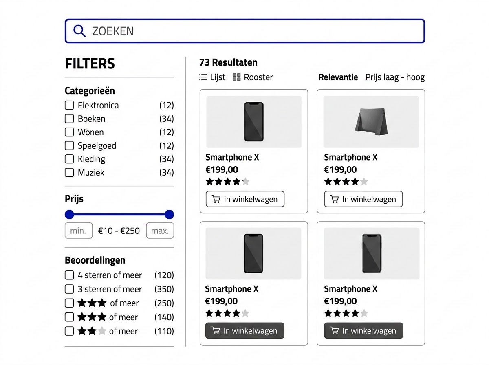
  <figcaption>Filterinterface van een e-commerce platform</figcaption>
</figure>

**Multi-view interfaces**

Het gebruik van multi-view interfaces (Nielsen Norman Group, z.d.) is een belangrijk patroon. Hierbij wordt dezelfde dataset op verschillende manieren gepresenteerd, bijvoorbeeld in de vorm van een overzicht, een tijdlijn en detailpagina's. Dit stelt gebruikers in staat om informatie te benaderen vanuit verschillende perspectieven, afhankelijk van hun behoeften.

Dit patroon is terug te zien in applicaties zoals Google Analytics, waar gebruikers kunnen schakelen tussen dashboards, grafieken en detailrapportages. Ook in kaartapplicaties zoals Google Maps kunnen gebruikers wisselen tussen verschillende weergaven, zoals kaart, satellietbeeld en navigatiemodus. In projectmanagementtools zoals Notion of Jira kunnen gegevens worden bekeken als lijst, board (Kanban) of tijdlijn. Door meerdere weergaven aan te bieden, kunnen gebruikers zelf bepalen hoe zij informatie het beste interpreteren en gebruiken.

<figure>
  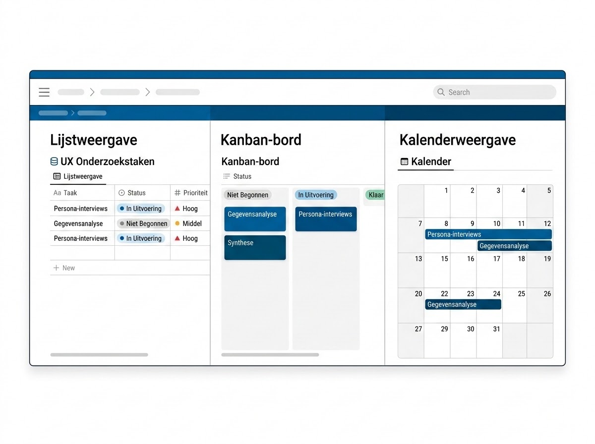
  <figcaption>Multi-view interface in een projectmanagementtool</figcaption>
</figure>

**Truncated breadcrumbs**

In moderne digitale interfaces, zoals Google Drive en Windows Verkenner (File Explorer), wordt vaak gebruikgemaakt van een vereenvoudigde vorm van breadcrumb-navigatie. Dit betreft doorgaans een zogenaamde *truncated* of *collapsed breadcrumb*, waarbij slechts een deel van het volledige navigatiepad zichtbaar is.

In plaats van de volledige hiërarchische structuur (bijvoorbeeld: *Mijn schijf \> Projecten \> 2025 \> Marketing \> Campagnes*), wordt het pad gedeeltelijk ingekort weergegeven om ruimte te besparen en de interface overzichtelijk te houden. In toepassingen zoals Google Drive wordt vaak alleen de huidige map of een beperkt deel van de hiërarchie getoond, terwijl de overige niveaus verborgen blijven.

Hoewel deze vorm visueel vereenvoudigd is, blijft het principe gebaseerd op hiërarchische navigatie. Door delen van het pad te verbergen, wordt de cognitieve belasting voor de gebruiker verminderd en blijft de focus op de huidige context behouden.

<figure>
  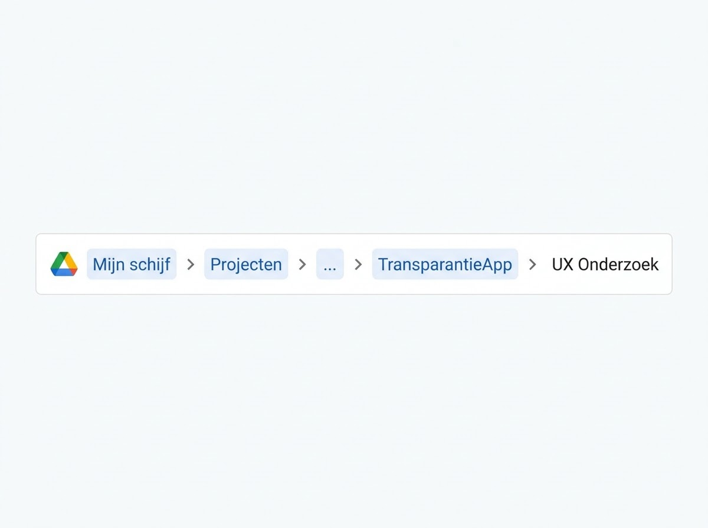
  <figcaption>Breadcrumbnavigatie in Google Drive</figcaption>
</figure>

### Uitwerking (Realize)

De TransparantieApp fungeert als verdiepingslaag op het dossieroverzicht van de Rijksapp door inzicht te bieden in de historische keten van gegevensverwerking. Het doel is om antwoord te geven op vragen over het 'wat', 'waarom' en 'hoe' van datagebruik tussen overheidsorganisaties. Ontwerpprincipes richten zich hierbij op het presenteren van tijdlijnen (op hoofdlijnen en in detail) en het managen van de cognitieve belasting, waarbij de kernuitdaging ligt in het filteren van relevante informatie en het inzichtelijk maken van oorzaak-gevolg relaties zonder de gebruiker te overspoelen met informatie.

- Hoe voorkom je dat informatie te complex of overweldigend wordt?

- Welke informatie is wel en niet relevant voor burgers?

In deze fase zijn twee verschillende prototypes ontwikkeld: een generiek design voor algemene overheidsinstanties en een specifiek prototype gericht op de WOZ-waarde. Na evaluatie van beide richtingen is besloten om de focus in het verdere traject volledig te leggen op de casus 'WOZ-waarde'. Deze afbakening maakt het mogelijk om het ontwerp specifieker, en daardoor beter testbaar, te maken voor eindgebruikers binnen een herkenbare context. Voor het algemene design, zie prototype 1. Voor het meer specifieke design voor de WOZ casus, zie prototype 2.

#### Prototype 1: Overzicht algemeen design

  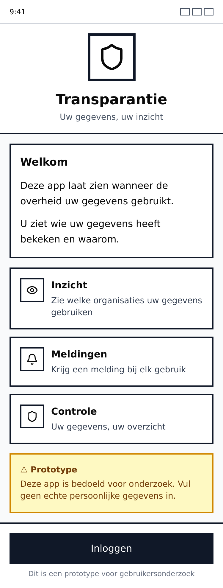
  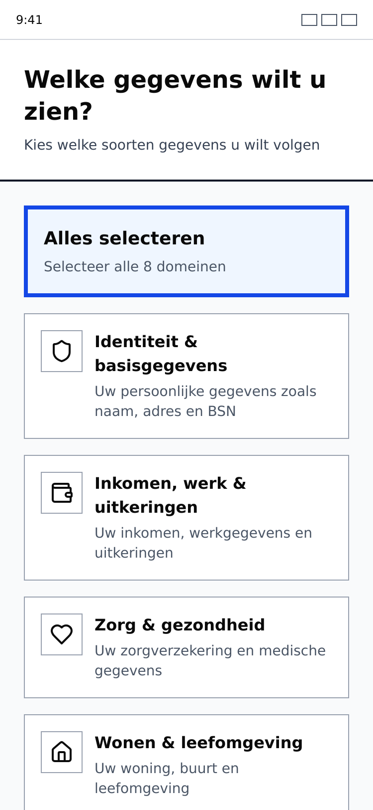

  <em>1. Inloggen</em>
  &nbsp;&nbsp;&nbsp;&nbsp;
  <em>2. Datadomeinen verkennen</em>

  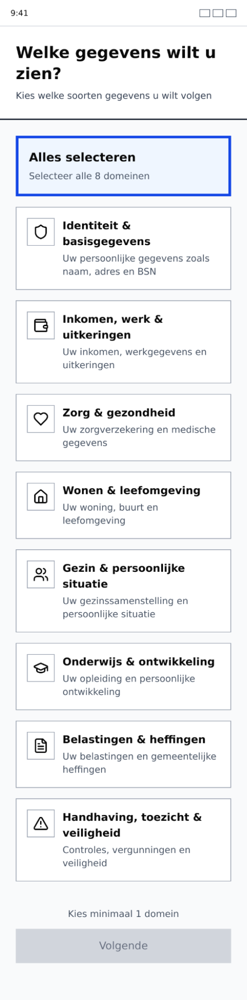
  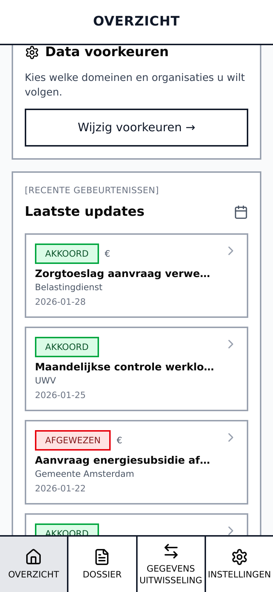

  <em>3. Datadomeinen selecteren</em>
  &nbsp;&nbsp;&nbsp;&nbsp;
  <em>4. Laatste updates</em>

  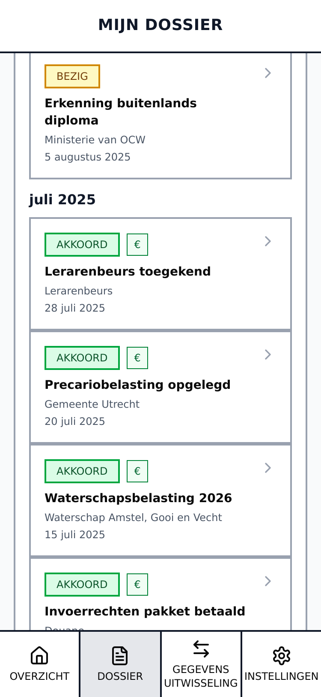
  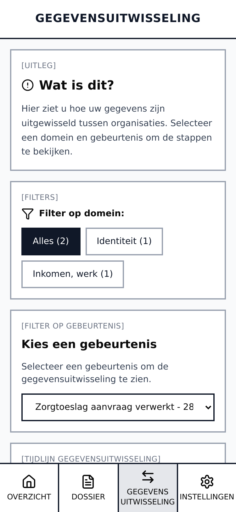

  <em>5. Mijn dossier</em>
  &nbsp;&nbsp;&nbsp;&nbsp;
  <em>6. Gegevensuitwisseling filteren</em>

  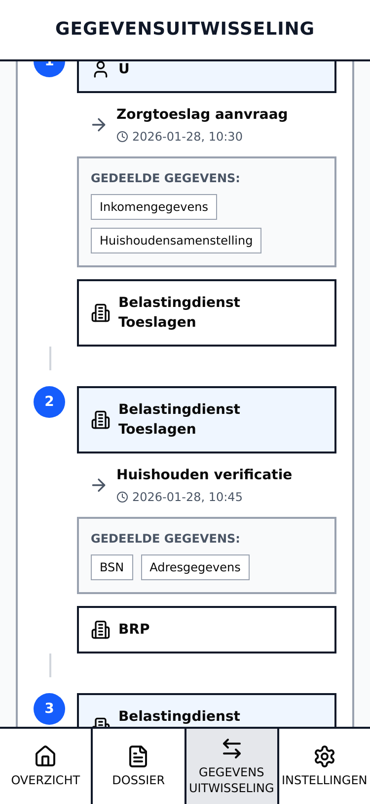
  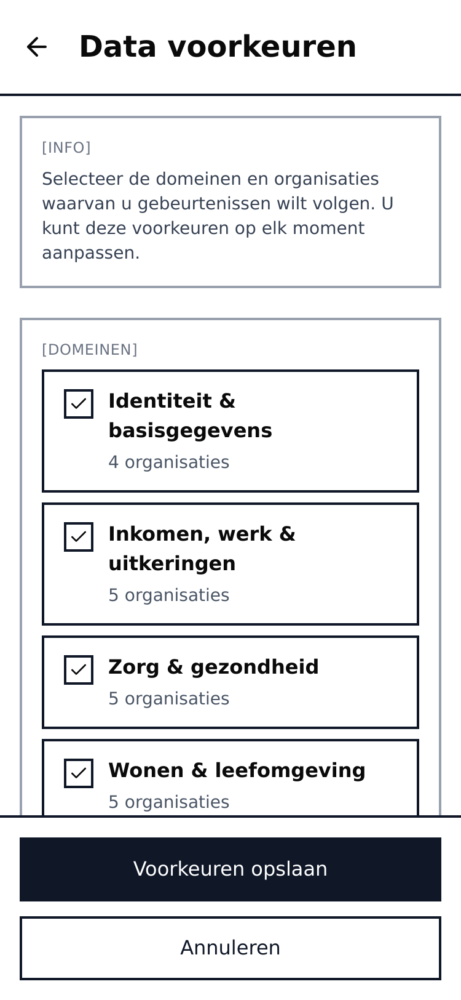

  <em>7. Stappen in de gegevensuitwisseling</em>
  &nbsp;&nbsp;&nbsp;&nbsp;
  <em>8. Datavoorkeuren beheren</em>

#### Prototype 2: Overzicht WOZ -gerichte design

  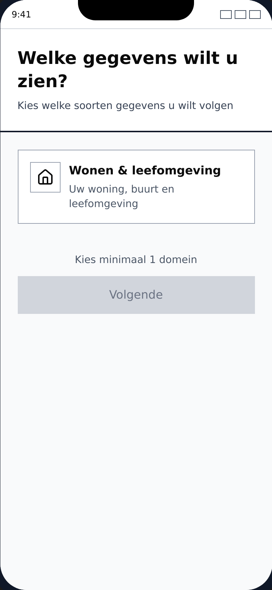
  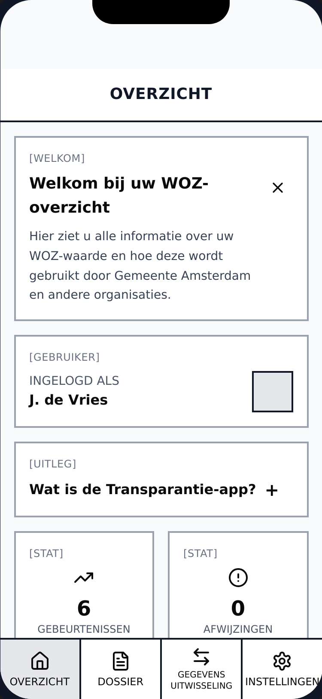

  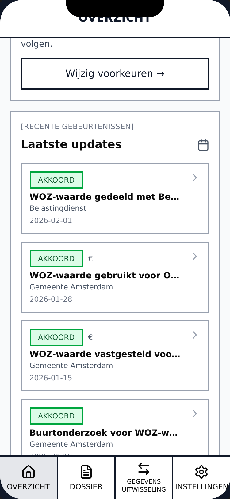
  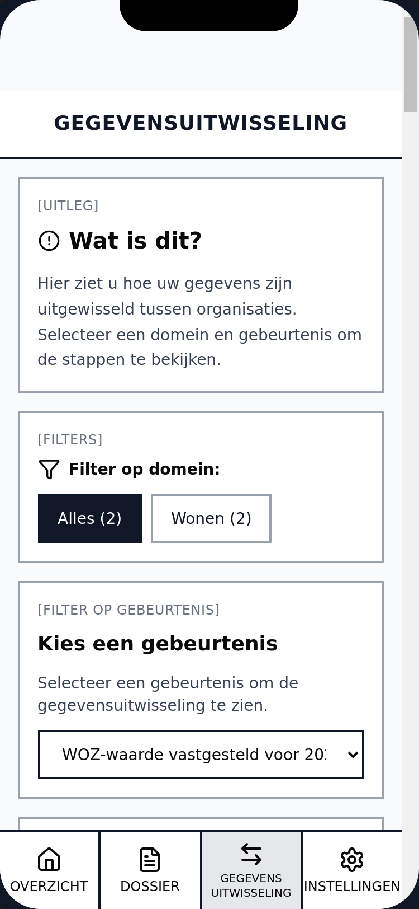

### Evaluatie (Evaluate)

In deze fase werd het eerste prototype van de Transparantie-app geëvalueerd met eindgebruikers, zowel via usability-tests als een vragenlijst (questionnaire). Het doel was om te toetsen in hoeverre het ontwerp aansluit bij het mentale model van de burger: hoe denken zij dat het systeem werkt en voldoet dit aan hun verwachtingen? Door middel van deze usability-tests en de vragenlijst zijn knelpunten in de navigatie en begrijpbaarheid geïdentificeerd, die dienen als input voor de verdere iteraties van het ontwerp en aanscherping van persona's.

#### Inzichten uit gebruikerstesten

Op basis van de uitgevoerde gebruikerstesten met het prototype van de TransparantieApp zijn verschillende knelpunten geïdentificeerd in het begrip, de navigatie, en de verwerking van informatie door gebruikers.

Gebruikers hebben moeite met het begrijpen van de propositie van de applicatie. Zij scannen de interface eerst en lezen pas daarna de inhoud, waardoor onduidelijke of abstracte formuleringen direct leiden tot verwarring.

Daarnaast vormt terminologie een belangrijke barrière. Begrippen sluiten onvoldoende aan op het mentale model van gebruikers, waardoor interpretatie extra inspanning kost.

Hoewel de inlogflow goed wordt begrepen, ervaren gebruikers na het inloggen desoriëntatie. Zij weten niet goed waar zij zich bevinden of wat de volgende stap is, zie 3.1.2 voor designs.

Ook de navigatie blijkt niet intuïtief. Gebruikers vinden informatie vaak via "laatste updates", wat wijst op een inbox- of timeline-achtig gebruiksmodel.

De tijdlijn wordt daarnaast als te gedetailleerd ervaren. Gebruikers geven aan vooral behoefte te hebben aan overzicht en kerninformatie, zoals betrokken organisaties en gebruikte gegevens.

**De link tussen gebruikerstesten en de theoretische UX patronen**

Op basis van de uitgevoerde gebruikerstesten met het prototype van de TransparantieApp zijn verschillende knelpunten geïdentificeerd in het begrip, de navigatie en de verwerking van informatie door gebruikers.

3 van de 10 eindgebruikers hebben moeite met het begrijpen van de propositie van de applicatie. Voor de rest scant iedereen eerst het interface en leest pas daarna de inhoud, waardoor onduidelijke of abstracte formuleringen direct leiden tot verwarring.

Daarnaast vormt terminologie een belangrijke barrière. Begrippen sluiten onvoldoende aan op het mentale model van gebruikers, waardoor interpretatie extra inspanning kost. Voorbeelden hiervan zijn woorden zoals transparantie, data, gebeurtenis, afwijzing (in context), goedgekeurd (in context), domein enbetrouwbaarheidsscore.

Hoewel de inlogflow goed wordt begrepen, ervaren gebruikers na het inloggen desoriëntatie. Zij weten niet goed waar zij zich bevinden of wat de volgende stap is. Zo zagen wij dan ook tijdens de gebruikerstesten dat er veel verschillende manieren werden vertoond om dezelfde informatie te vinden. De navigatie werd dan ook niet ervaren als intuïtief. De meeste gebruikers, 7 van de 10, vinden informatie vaak via "laatste updates", wat wijst op een inbox- of timeline-achtig gebruiksmodel en sluit aan bij wat gebruikers gewend zijn bij mijn berichtenbox-achtige omgevingen zoals MijnOverheid.

De tijdlijn wordt daarnaast als te gedetailleerd ervaren door 5 van de 10 gebruikers. Gebruikers geven aan vooral behoefte te hebben aan overzicht en kerninformatie, zoals betrokken organisaties en gebruikte gegevens.

Deze bevindingen kunnen worden verklaard vanuit bestaande UX-patronen.

De complexiteit van de tijdlijn en het gebrek aan overzicht wijzen op het ontbreken van progressive disclosure. Gebruikers krijgen te veel informatie tegelijk aangeboden zonder duidelijke hiërarchie.

Het feit dat gebruikers informatie zelf groeperen rondom organisaties en gegevens, sluit aan bij *chunking* (Nielsen Norman Group, z.d.). Gebruikers zoeken naar herkenbare structuren om informatie te verwerken.

De problemen met terminologie benadrukken het belang van *recognition over recall* (Nielsen Norman Group, z.d.). Informatie moet herkenbaar en niet abstract zijn, zodat gebruikers niet hun best hoeven te doen om termen te onthouden.

De desoriëntatie na login wijst op een gebrek aan *contextual navigation*. Gebruikers missen duidelijke context en oriëntatie.

Daarnaast bevestigt het gedrag rondom "laatste updates" het belang van timeline- en inboxpatronen. Deze sluiten beter aan bij de bestaande mentale modellen die momenteel binnen de overheid worden gehanteerd dan een puur hiërarchische structuur of app-structuur.

Tot slot onderstrepen de resultaten het belang van zoek- en filtermechanismen, aangezien gebruikers niet lineair navigeren maar juist gericht zoeken.

#### Resultaten vragenlijst (geprioriteerd)

Naast de usability tests is een questionnaire uitgevoerd onder 30 deelnemers om inzicht te krijgen in de behoeften en prioriteiten van gebruikers met betrekking tot transparantie van data en besluitvorming. De volledige opzet en inhoud van deze vragenlijst zijn gedetailleerd terug te vinden in de Bijlage: Vragenlijst Data Transparantie.

De resultaten laten zien dat gebruikers een duidelijke hiërarchie aanbrengen in de informatie die zij belangrijk vinden. Deze prioriteiten zijn hieronder weergegeven van hoog naar laag met een puntenverdeling. De methode die hier gebruikt is om tot de punten te komen, is terug te vinden in de personamatrix. Een personamatrix is een methodiek waarbij kwalitatieve inzichten uit persona's en kwantitatieve data uit enquêtes worden gecombineerd om behoeften te prioriteren. In dit onderzoek fungeert de matrix als instrument om de resultaten uit de vragenlijst te kwantificeren (door punten toe te kennen), waardoor objectief vastgesteld kan worden welke informatiebehoeften voor de verschillende doelgroepen de hoogste prioriteit hebben (Tomorrow People, n.d).

**Hoge prioriteit: overzicht, begrijpelijkheid en directe actie**

Gebruikers hechten de meeste waarde aan informatie die direct inzicht geeft in wat er met hun gegevens gebeurt en wat dit voor hen betekent. De hoogste prioriteit ligt bij:

- Samenvatting van de gegevens

- Uitkomst van een proces (500)

- Filters (500)

- Zoekfunctie (500)

- Glossary / uitleg (500)

- Informatie bij afkortingen (500)

- Tour van de applicatie (500)

- Werkelijke gegevens zelf (467)

- Organisaties betrokken (434)

- Gedeelde gegevens (400)

- Actieknoppen (zoals bezwaar of contact) (397)

Deze resultaten tonen aan dat gebruikers vooral behoefte hebben aan overzicht, begrijpelijke uitleg en handelingsperspectief. Zij willen snel kunnen zien wat er gebeurt, dit kunnen begrijpen en indien nodig actie kunnen ondernemen.

**Middelmatige prioriteit: context en verklarende informatie**

Naast het overzicht geven gebruikers aan dat zij behoefte hebben aan aanvullende context, maar pas nadat de basisinformatie duidelijk is. Middelmatig belangrijke elementen zijn:

- Waarom gegevens worden gebruikt (330)

- Welke wetten van toepassing zijn (261)

- Bewaartermijn van gegevens (257)

Deze informatie helpt gebruikers om de achterliggende redenen en kaders te begrijpen, maar wordt niet als eerste informatiebehoefte gezien. Dit bevestigt dat context vooral relevant is als verdieping.

**Lagere prioriteit: technische en systeemgerichte informatie**

Informatie die betrekking heeft op de technische werking van systemen en processen wordt als minst belangrijk ervaren door gebruikers. Hieronder vallen:

- Verwerkingsactiviteiten (220)

- Verantwoordelijke partijen (226)

- Tijd (193)

- Regels die invloed hadden (193)

- Algoritmes (130)

Deze resultaten laten zien dat gebruikers weinig behoefte hebben aan diepgaande technische details. Deze informatie is vooral relevant voor een kleine groep gebruikers en dient daarom optioneel beschikbaar te zijn.

**Belangrijk inzicht**

De resultaten van de questionnaire laten zien dat gebruikers een duidelijke voorkeur hebben voor een gelaagde opbouw van informatie:

1.  **Eerst:** overzicht, uitkomst en directe relevantie

2.  **Daarna:** context en uitleg

3.  **Tot slot:** technische en diepgaande informatie

Dit sluit direct aan bij het principe van *progressive disclosure* en bevestigt dat informatie binnen de TransparantieApp stapsgewijs en op basis van relevantie moet worden aangeboden.

### Het mentale model van de burger

Een belangrijk inzicht uit het onderzoek is dat het mentale model van gebruikers sterk afwijkt van de manier waarop systemen data structureren. Waar systemen vaak werken met abstracte processen, datastromen en technische relaties, denken gebruikers in concrete en herkenbare elementen.

Gebruikers benaderen informatie voornamelijk vanuit vragen als: welke organisatie gebruikt mijn gegevens, welke gegevens zijn dat, en wat betekent dit voor mij? Dit laat zien dat abstracte termen niet vanzelfsprekend worden begrepen en vertaald moeten worden naar begrijpelijke taal en herkenbare categorieën.

Daarnaast blijkt dat gebruikers een duidelijke voorkeur hebben voor een gelaagde opbouw van informatie. Zij willen eerst een overzicht zien van wat er is gebeurd, waarna zij zich eventueel verder kunnen verdiepen in context en details. Dit onderstreept het belang van een informatiearchitectuur waarin hoofdlijnen en details duidelijk van elkaar worden gescheiden.

Gebruikers hebben bovendien een beperkte tolerantie voor complexiteit. Wanneer er te veel informatie tegelijk wordt gepresenteerd of wanneer de structuur onduidelijk is, raken zij snel het overzicht kwijt. Dit kan leiden tot desoriëntatie en een verminderde bruikbaarheid van de applicatie.

Tot slot zijn er verschillen zichtbaar tussen gebruikersgroepen. Sommige gebruikers zoeken vooral duidelijkheid en eenvoud, terwijl anderen meer behoefte hebben aan controle en inzicht. Daarnaast is er een groep kwetsbare gebruikers die extra ondersteuning nodig heeft bij het begrijpen en gebruiken van digitale systemen. Het ontwerp, of de TransparantieApp, moet daarom ruimte bieden aan verschillende niveaus van digitale vaardigheid en informatiebehoefte.

### Implicaties voor het ontwerp

De combinatie van gebruikerstesten en de onderzochte UX-patronen leidt tot concrete ontwerpimplicaties voor de Transparantie-App.

Allereerst moet informatie gelaagd worden aangeboden door middel van *progressive disclosure*. Gebruikers hebben behoefte aan een duidelijk overzicht voordat zij de diepte ingaan. Dit betekent dat de applicatie moet beginnen met een samenvatting van de belangrijkste informatie, zoals de uitkomst, betrokken organisaties en gebruikte gegevens, waarna gebruikers kunnen doorklikken naar meer detail.

Aanvullend hierop speelt *progressive summarization* (Nielsen Norman Group, z.d.)een rol, waarbij informatie eerst in beknopte vorm wordt gepresenteerd. Dit sluit aan bij het scangedrag van gebruikers en voorkomt dat zij worden overweldigd door grote hoeveelheden informatie.

Daarnaast moet informatie worden gestructureerd volgens het principe van *chunking*. Uit de gebruikerstesten blijkt dat gebruikers informatie groeperen rond organisaties en gegevens. Door deze structuur expliciet toe te passen in het ontwerp, wordt beter aangesloten op het mentale model van gebruikers en wordt de begrijpelijkheid vergroot.

Het toepassen van *visual hierarchy* (Nielsen Norman Group, z.d). is essentieel om duidelijk te maken welke informatie prioriteit heeft. Belangrijke elementen, zoals de uitkomst of kerninformatie, moeten visueel prominenter worden weergegeven dan secundaire details. Dit ondersteunt gebruikers bij het snel scannen en interpreteren van de interface.

Ook de terminologie moet worden vereenvoudigd volgens het principe van *recognition over recall*. Gebruikers moeten informatie direct kunnen herkennen, zonder deze eerst te moeten interpreteren. Dit betekent dat abstracte termen vervangen moeten worden door concrete en begrijpelijke taal.

Verder is het noodzakelijk om *contextual navigation* te versterken. Gebruikers moeten continu inzicht hebben in waar zij zich bevinden binnen de applicatie. Dit kan worden ondersteund door duidelijke navigatie-elementen zoals sticky navigatie, contextuele labels, of vereenvoudigde (truncated) breadcrumbs.

De observatie dat gebruikers informatie via "laatste updates" vinden,

onderstreept het belang van *timeline- en inboxpatronen.* De applicatie dient daarom een chronologische structuur te bieden waarin recente gebeurtenissen centraal staan en eenvoudig terug te volgen zijn.

Daarnaast moeten *zoek- en filtermechanismen* centraal staan in de interactie. In plaats van gebruikers door een volledige hiërarchie te laten navigeren, moeten zij snel relevante informatie kunnen vinden via zoeken en filtering. Dit sluit aan bij hedendaags gebruikersgedrag en vermindert de cognitieve belasting.

Tot slot is het toepassen van *multi-view interfaces* van belang. Door verschillende weergaven aan te bieden, zoals een overzicht, een tijdlijn en detailpagina's, kunnen gebruikers informatie benaderen op een manier die past bij hun behoeften en voorkeuren.

De resultaten of de questionnaire laten zien dat gebruikers een duidelijke voorkeur hebben voor een gelaagde opbouw of informatie:

1.  **Eerst:** overzicht, uitkomst en directe relevantie

2.  **Daarna:** context en uitleg

3.  **Tot slot:** technische en diepgaande informatie

Dit sluit direct aan bij het principe van *progressive disclosure* en bevestigt dat informatie binnen de Transparantie-app stapsgewijs en op basis van relevantie moet worden aangeboden.

## Tweede iteratie

De tweede iteratie richtte zich op de definitieve validatie en verfijning van het ontwerp uit de eerste cyclus. In deze fase werd het ontwerpproces aangescherpt door middel van co-creatie, waarbij externe perspectieven werden geïntegreerd. Gedurende het proces werd besloten om de focus te verleggen van de WOZ-casus naar de PGO-omgeving (Persoonlijke Gezondheidsomgeving). Deze keuze werd ingegeven door de noodzaak om het ontwerp en de mogelijkheden van de data beter op elkaar af te stemmen. Het vorige ontwerp leek te ver af te wijken wat er met data-logboek verwerking technisch mogelijk kon ondersteunen. Het was daarom belangrijk dat de nieuwe casus meer realistisch was en meer in lijn met het beoogde doel van de standaard.

Daarnaast bood de samenwerking met het Ministerie van Volksgezondheid, Welzijn en Sport (VWS) de mogelijkheid om de casus in een realistische context verder uit te werken en te valideren. Deze fase werd afgesloten met een uitgebreide evaluatie, waaronder A/B-testen en kwalitatief onderzoek, om de vindbaarheid en transparantie van het systeem te toetsen.

### Iterate & Define

De co-creatiesessie met designers van Logius heeft geleid tot een scherpere focus op de behoeften van de eindgebruiker binnen de WOZ-casus. De sessie leverde concrete inzichten op over het vertalen van complexe datalogging naar intuïtieve interfacecomponenten. Hierbij lag de nadruk op het creëren van een transparante dialoog tussen burger en overheid. De uitkomsten zijn vertaald naar twee kernconcepten die de basis vormen voor verdere prototyping en validatie.

Uit de co-creatiesessie kwamen twee concepten gebaseerd op de WOZ Casus. Hierbij zijn ook verscheidene schetsen gemaakt.

#### Concept 1 – Waarom-knop & Transparantiecomponent

**Doel**

Burgers direct inzicht geven in de redenen achter een specifiek besluit of gegevensverwerking om wantrouwen te voorkomen.

**Probleem**

Burgers begrijpen niet waarom bepaalde gegevens zijn opgevraagd of waarom een besluit negatief uitvalt, wat leidt tot onzekerheid.

**Persona**

Fatima (De controlerende burger) en Marc (De praktische gebruiker).

**User Journey**

Inzage in dossier \> Onverwachte gegevensuitwisseling \> Behoefte aan verklaring \> Klikt op 'Waarom' \> Ontvangt gelaagde uitleg.

**Oplossing**

Een prominente 'Waarom'-knop bij elke processtap die een transparantie component opent met contextuele informatie.

**Ontwerpprincipes**

- Progressive disclosure: toon eerst de kernreden, dan details.

- Contextual navigation: blijf binnen de huidige taak flow.

**Samenvatting**

Dit concept verlaagt de drempel voor transparantie door uitleg een integraal onderdeel te maken van de interface.
<figure>
  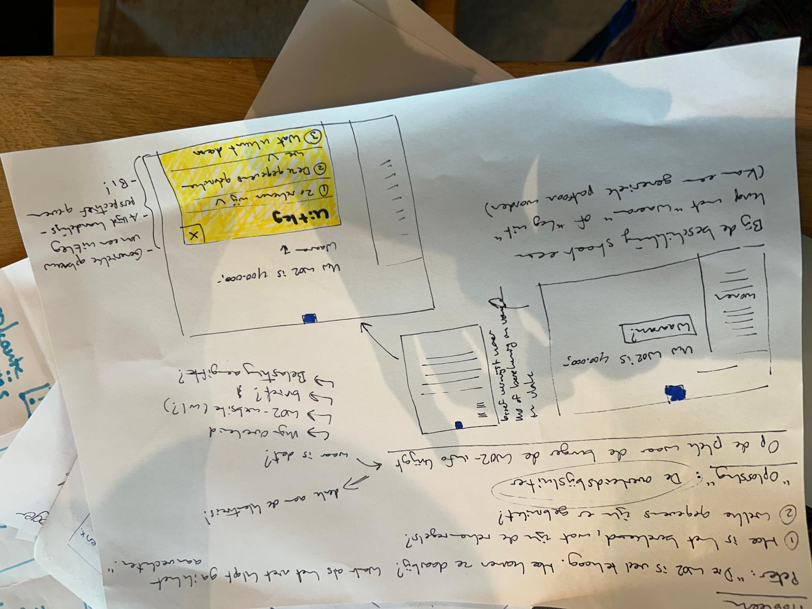
  <figcaption>Eerste conceptschetsen van de ‘Waarom-knop’ en transparantiecomponent. De schets toont hoe uitleg over besluitvorming, zoals de WOZ-waarde, direct toegankelijk kan worden gemaakt in de interface.</figcaption>
</figure>

<figure>
  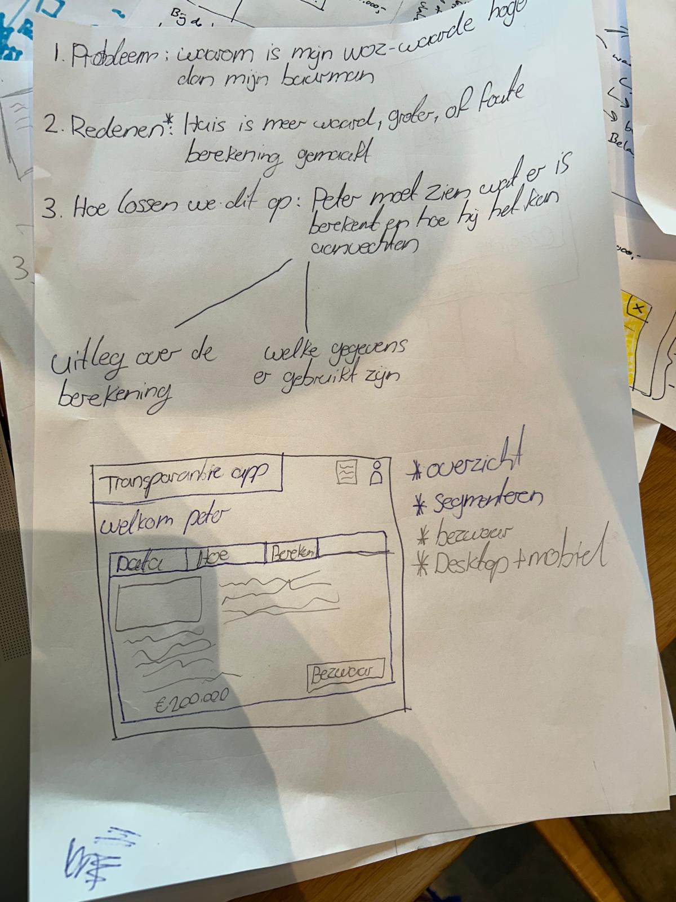
  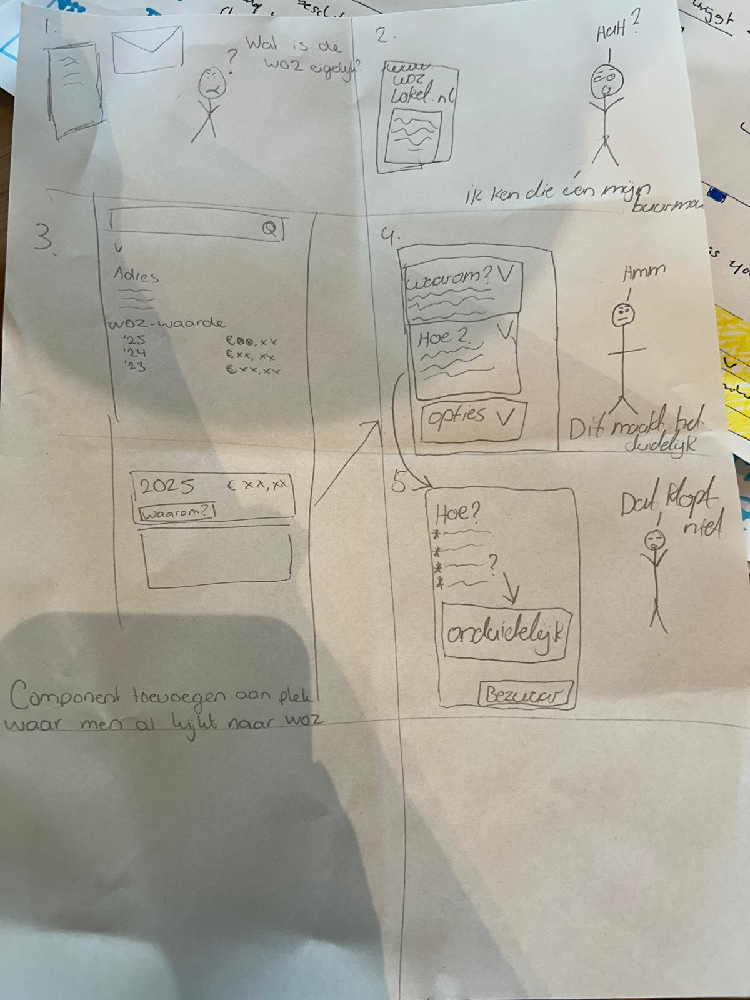
  <figcaption>Aanvullende schetsen van de transparantiecomponent waarin de gelaagde opbouw van informatie wordt verkend.</figcaption>
</figure>

<figure>
  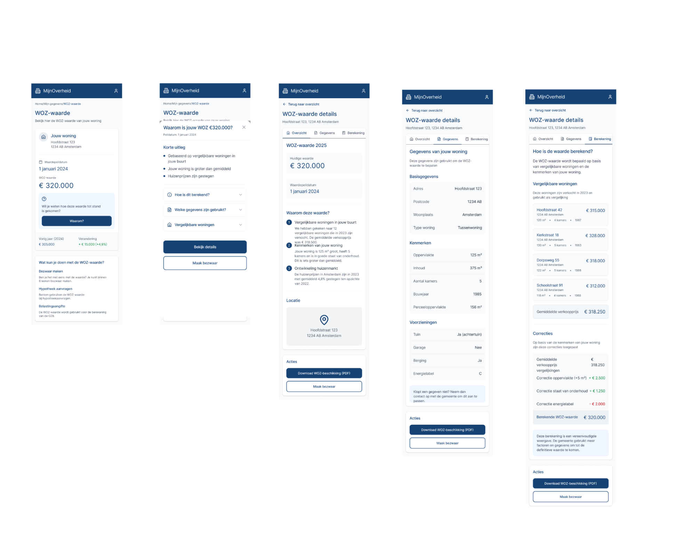
  <figcaption>Detailweergave van de interface met de ‘Waarom’-uitleg voor specifieke processtappen.</figcaption>
</figure>

#### Concept 2 – Hulp & Begeleiding (Els)

**Doel**

Ondersteuning bieden aan gebruikers die moeite hebben met het begrijpen van overheidsinformatie, zodat zij de juiste acties kunnen ondernemen.

**Probleem**

Gebruikers zoals Els begrijpen de informatie in brieven en digitale omgevingen niet, wat leidt tot onzekerheid en hulpeloosheid.

**Persona**

Els (De minder digitaal vaardige gebruiker).

**User Journey**

Ontvangst brief \> Bezoek MijnOverheid/WOZ \> Keuze tussen 'Waarom?' of 'Hulp nodig?' \> Begeleiding via FAQ/Chatbot \> Actie ondernemen.

**Oplossing**

Een geïntegreerde 'Hulp nodig?'-component met FAQ en chatbot-integratie.

**Ontwerpprincipes**

- Begeleiding bieden (niet enkel informatie).

- Emotie en onzekerheid erkennen.

- Beperkt aantal keuzes (max 3-4).

- Toegankelijke taal (geen jargon).

- Ondersteuning van meerdere routes.

**Samenvatting**

Dit concept combineert uitleg, begeleiding en hulp in één toegankelijke ervaring voor gebruikers die extra steun nodig hebben.

**Prototype**

[<u>https://carve-bagel-18994557.figma.site</u>](https://carve-bagel-18994557.figma.site/)

<figure>
  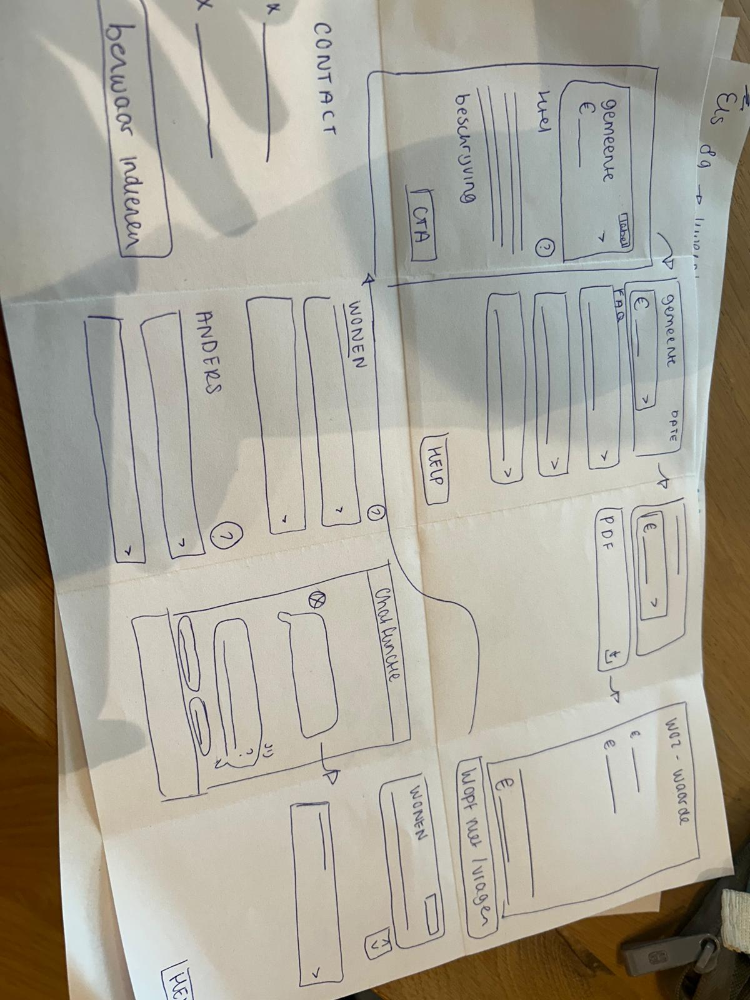
  <figcaption>Conceptschets voor ‘Hulp & Begeleiding’, met focus op toegankelijke navigatie voor kwetsbare burgers.</figcaption>
</figure>

<figure>
  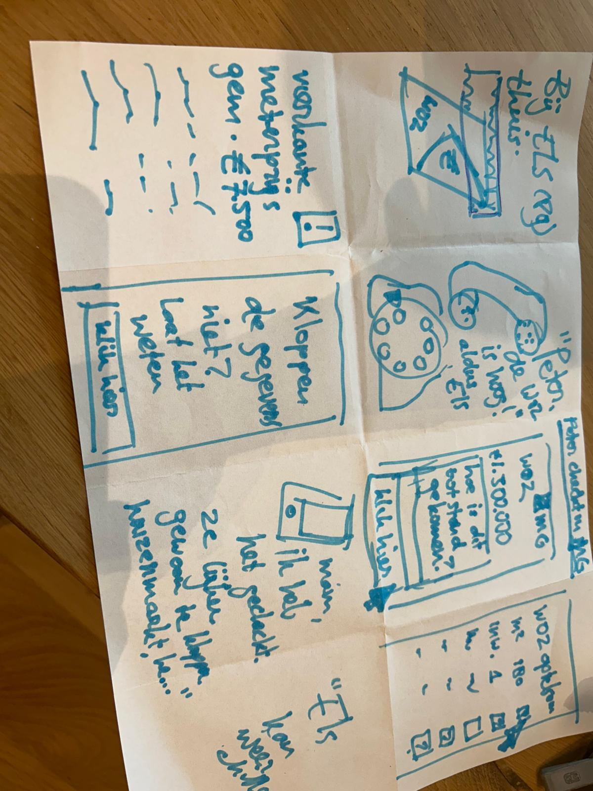
  <figcaption>Uitwerking van het helpcentrum en de interactieve tour om de gebruiker stapsgewijs te ondersteunen.</figcaption>
</figure>

<figure>
  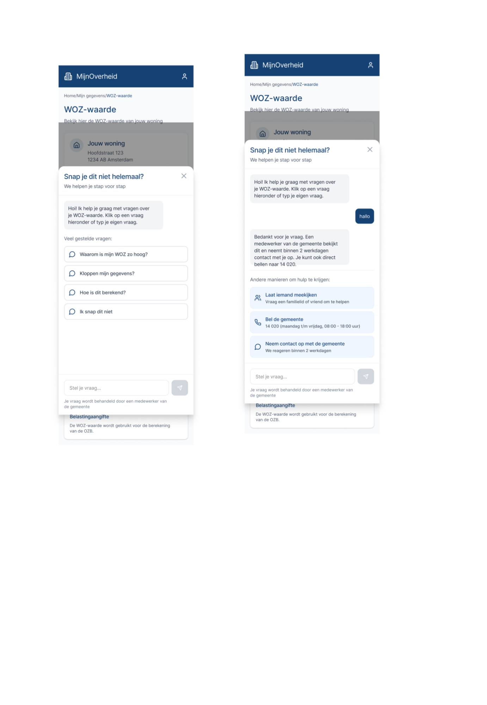
  <figcaption>Overzicht van de hulpchat voor gebruikers die bepaalde tijdlijnen niet begrijpen.</figcaption>
</figure>

### Realize

Na de evaluatie en verfijning van de initiële WOZ-casus, is het ontwerp in deze fase doorvertaald naar de context van een Persoonlijke Gezondheidsomgeving (PGO). Hierbij zijn de succesvolle UX-patronen uit de eerste iteratie, zoals progressive disclosure, tijdlijn visualisaties en gelaagde informatiearchitectuur, toegepast op de complexere en gevoelige datastromen binnen de zorg. Deze transitie naar een PGO-usecase maakt het mogelijk om de schaalbaarheid en robuustheid van de ontwikkelde componenten te toetsen in een omgeving met diverse, intensieve gegevensuitwisselingen en te valideren of de transparantie-ervaring ook bij medische persoonsgegevens aansluit bij de behoeften van de gebruiker.

Deze patronen zijn in eerste instantie geprototyped met behulp van het [NL Design System](https://nldesignsystem.nl/). Tijdens dit proces bleek echter dat het ontwerp voor de datavisualisaties niet volledig aansloot bij de kernfilosofie van dit systeem. Waar het NL Design System is geoptimaliseerd voor informatieve systemen zoals MijnOverheid, zijn complexe datavisualisaties momenteel nog geen structureel onderdeel van de bibliotheek. Om de interactieve ervaringen toch accuraat te kunnen visualiseren en de gebruikersbehoeften effectief te valideren, is ervoor gekozen om de verdere visualisatieontwikkeling voort te zetten in Figma Make. De interactieve kracht van Figma Make bood een significant voordeel bij het testen van de gewenste gebruikersinteracties.

Tijdens het ontwerpproces was een doel om ook te onderzoeken of het presenteren van de tijdlijn via diverse weergaven, in de literatuur aangeduid als multi-view, bijdraagt aan een beter begrip van de gegevens bij eindgebruikers. Wegens de capaciteit van Figma om interactieve ervaringen snel te visualiseren en valideren, was het mogelijk om de 'multi-view' concepten effectief toetsen bij gebruikers.

Om de impact van de informatiearchitectuur op de begrijpelijkheid te valideren, zijn twee verschillende prototypes ontwikkeld. Het eerste prototype volgt een standaard navigatie-opbouw (Menu \> Tijdlijn \> Detailoverzicht) en fungeert als het referentiekader voor de gebruikelijke informatiestromen. Het tweede prototype biedt een flexibele datastructuur, waarin gebruikers de mogelijkheid hebben om de informatie zowel chronologisch (tijdlijn) als hiërarchisch (organisatieoverzicht) te rangschikken. Door middel van een interactieve 'toggle' in het prototype konden gebruikers naadloos schakelen tussen deze twee perspectieven. Hiermee was het mogelijk om in de testomgeving direct te observeren welke ordeningsmethode het meest intuïtief is voor het beantwoorden van specifieke hulpvragen.

#### Prototype 1: normale flow Mijn PGO → Tijdlijn → Detail

  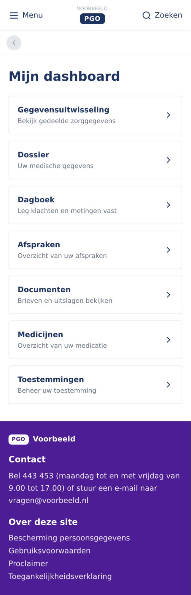
  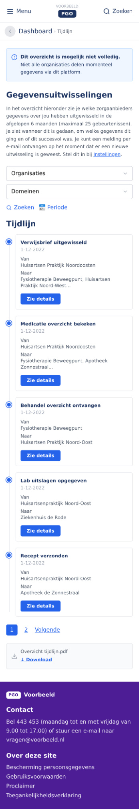

  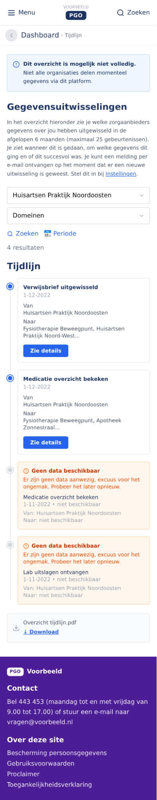
  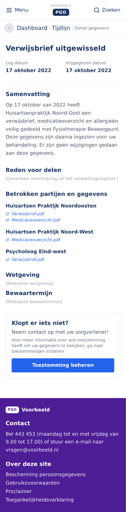

#### Prototype 2: normale flow Mijn PGO → Toggle

  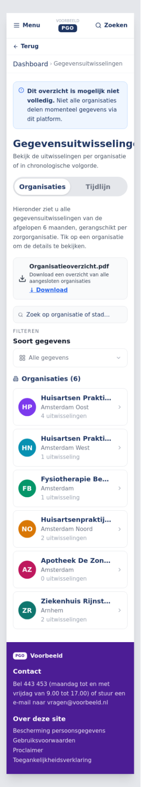

### Evaluate

Om deze ontwerpiteratie te evalueren is een A/B-test uitgevoerd en is via kwalitatief onderzoek de vindbaarheid en transparantie van het systeem getoetst.

#### Kwantitatieve resultaten (A/B-test)

##### Algemene conclusies kwantitatieve analyse

De applicatie wordt in het algemeen als ruim bovengemiddeld overzichtelijk beschouwd: gemiddeld tussen de twee versies een 5.7/7, oftewel een score van 81%. Dit getal weerspiegelt zich ook in het slagingspercentage van de taken, 84% in beide versies.

Het ervaren gemak van het uitvoeren van de taken (en dus van het opzoeken van diverse relevante data door middel van het overzicht gegevensuitwisselingen) was gemiddeld 5.4/7, dus 77%. De benodigde tijd om een taak uit te voeren was gemiddeld ongeveer een minuut (64.5 seconden).

Dit alles samengenomen suggereert dat, ongeacht de versie, het gedeelte gegevensuitwisselingen van de applicatie als overzichtelijk, duidelijk en goed bruikbaar zonder al te veel verwarring en vertraging wordt ervaren.

##### Vergelijkende conclusies kwantitatieve analyse

Qua gemiddeld gerapporteerd gebruiksgemak lagen de tijdlijnversie en de organisatieversie dicht bij elkaar, respectievelijk een 5.32 en een 5.48. Ook wat de verdere geaggregeerde data betreft scoorden beide versies vergelijkbaar, met een 5.6 (tijdlijn) en een 5.8 (organisatie) voor overzichtelijkheid, een gemiddelde tijd per taak van 65,72 seconden (tijdlijn) en 63,21 seconden (organisatie), en een identiek slagingspercentage van 84%.

In grote lijnen suggereert de data dus dat de organisatieversie beter werkt dan de tijdlijnversie, maar slechts marginaal. Bij het nader bekijken van de individuele taken, worden echter relevantere verschillen zichtbaar (zie figuur 13).

<figure>
  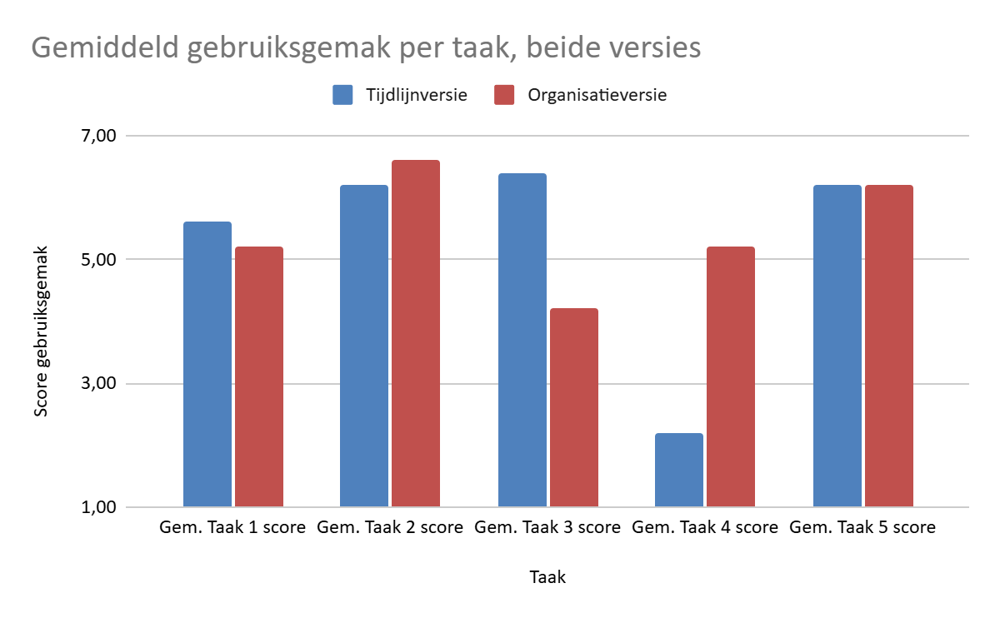
  <figcaption>Gemiddeld gebruiksgemak per taak, vergeleken tussen de tijdlijnversie en de organisatieversie.</figcaption>
</figure>

<figure>
  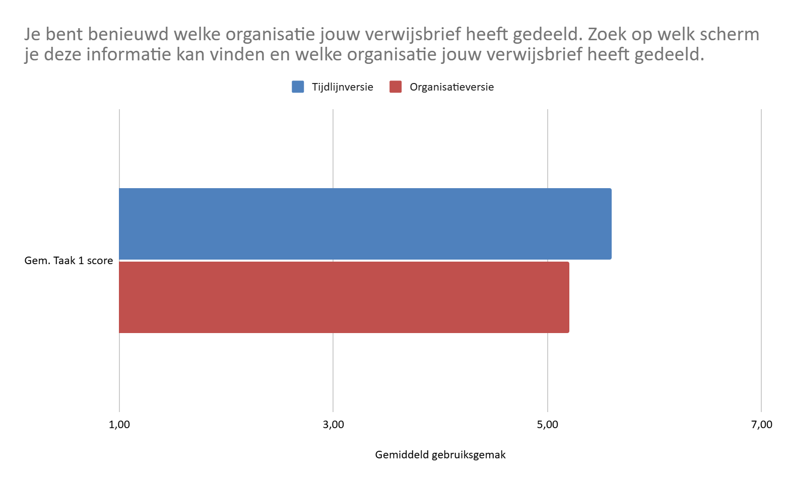
  <figcaption>Gemiddeld gebruiksgemak voor taak 1.</figcaption>
</figure>

Zoals te zien was er geen significant verschil in ervaren gebruiksgemak tussen de twee versies wat betreft het vinden van de organisatie die de verwijsbrief van de gebruiker gedeeld heeft, hoewel de voorkeur lichtelijk naar de tijdlijnversie ging (5,6 tegen 5,2). Er was wel in beide gevallen verwarring over de juiste navigatie, zoals eerder in het document omschreven werd.

<figure>
  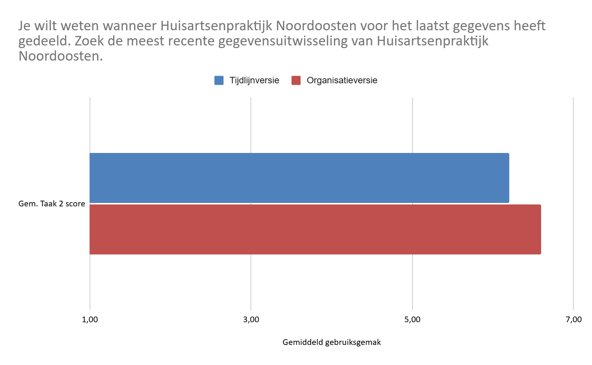
  <figcaption>Gemiddeld gebruiksgemak voor taak 2.</figcaption>
</figure>

Ook voor het vinden van de laatste gegevensuitwisseling was er geen groot verschil in ervaren gebruikersgemak. In dit geval had de organisatieversie een minimale voorkeur (6,6 tegen 6.2), maar het slagingspercentage van deze taak was in beide gevallen 100%.

<figure>
  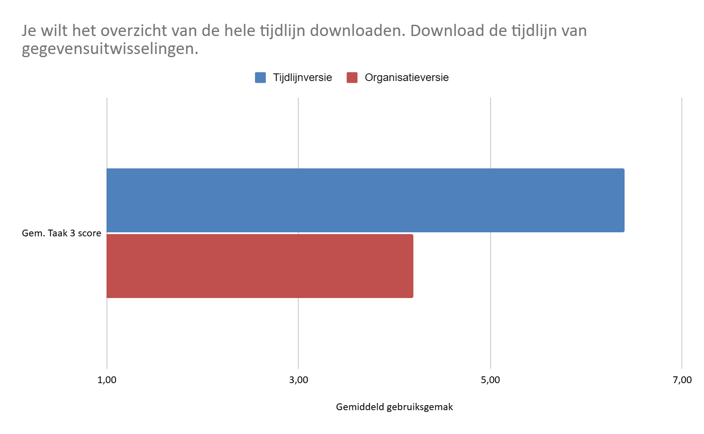
  <figcaption>Gemiddeld gebruiksgemak voor taak 3.</figcaption>
</figure>

Dit was de eerste taak waarin een significant verschil werd waargenomen. Het downloaden van de tijdlijn was voor testers van de tijdlijnversie simpel, terwijl twee van de testers van de organisatievisie er niet in slaagden om de taak te voltooien. Met een score van 4,2 tegen 6,4, een verschil van ruim 31% ervaren gebruiksgemak, is dit duidelijk een zwakte van de organisatieversie.

<figure>
  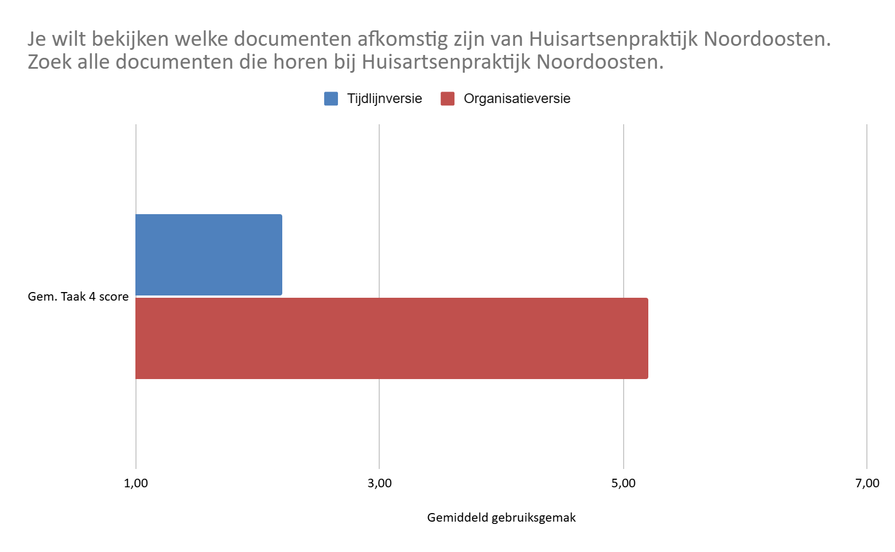
  <figcaption>Gemiddeld gebruiksgemak voor taak 4.</figcaption>
</figure>

Het gemak van het vinden van alle documenten bij een specifieke organisatie liep nog verder uiteen: drie falende testers bij de tijdlijnversie versus één bij de organisatieversie, scores van 2,2 tegen 5,2, een verschil van 43%. Dit resultaat maakt duidelijk dat het organisatiefilter op de tijdlijnversie significant minder goed werkt voor eindgebruikers dan de organisatievisie als het aankomt op het vinden van data per organisatie.

<figure>
  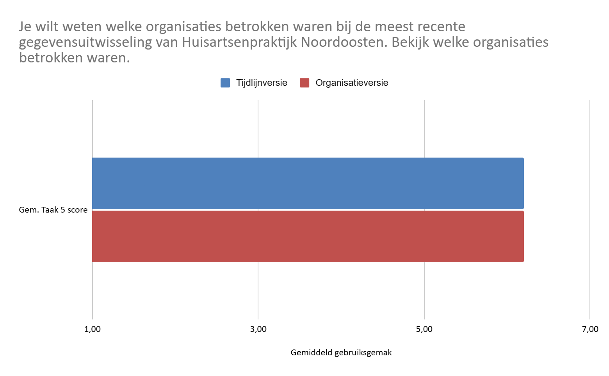
  <figcaption>Gemiddeld gebruiksgemak voor taak 5.</figcaption>
</figure>

De laatste taak, het uitzoeken welke organisaties betrokken waren bij de meest recente gegevensuitwisseling, scoorde in beide versies identiek (6,2) en had in beide gevallen een slagingspercentage van 100%.

Samenvattend: beide versies scoren gemiddeld goed en vergelijkbaar, met een lichte voorkeur voor de organisatieversie, en beide versies hebben één duidelijk voordeel ten opzichte van de ander. De tijdlijnversie maakt het significant makkelijker om een overzicht van de tijdlijn te downloaden, en de organisatieversie maakt het significant makkelijker om alle data per organisatie te vinden. Dit suggereert dat beide versies acceptabel zijn, en dat toegang tot beide versies het beste zou zijn voor de eindgebruiker.

### Kwalitatieve analyse en suggesties van andere researcher

Het is duidelijk dat er nog wat initiële verwarring is op het eerste scherm met de vele opties, maar toch vinden de meeste gebruikers het uiteindelijk goed bruikbaar. Ook wordt terecht genoemd dat er op het moment veel tekst en weinig andere visuele vormgeving wordt gebruikt, waarschijnlijk kan de usability nog significant verbeteren door dit aan te passen.

Het was men duidelijk waar ze mee bezig waren, ze zouden het zelf gebruiken als het relevant voor ze was en ze vinden het taalgebruik duidelijk, dat dit alles toont dat het in de huidige staat al een zeer acceptabel product is. Vooral het totaaloverzicht mag nog iets duidelijker en de grafische vormgeving kan verbeterd, verder waren de gebruikers tevreden.

Waarschijnlijk is de beste optie om gebruikers zowel een tijdlijn overzicht als een organisatie overzicht te geven, aangezien dat eerste toch fijn lijkt te zijn voor de 'big picture' en een overzicht per organisatie blijkbaar toch makkelijker is dan een filter op de tijdlijnversie.

#### Resultaten kwalitatieve analyse

**Gegevensuitwisseling versus documenten**

Uit de gebruikerstest blijkt dat de knop **Gegevensuitwisseling** over het algemeen goed vindbaar is. Van de tien deelnemers vonden er acht direct de juiste plek en uiteindelijk slaagden per variant vier van de vijf deelnemers erin om de gevraagde informatie te vinden. Tegelijkertijd blijkt dat de mentale verwachting van gebruikers niet altijd overeenkomt met de gekozen navigatiestructuur. Vier van de tien deelnemers gaven aan dat het slechts gedeeltelijk duidelijk was waar ze moesten zoeken, één van de tien gaf aan dat het totaal niet duidelijk was.

<figure>
  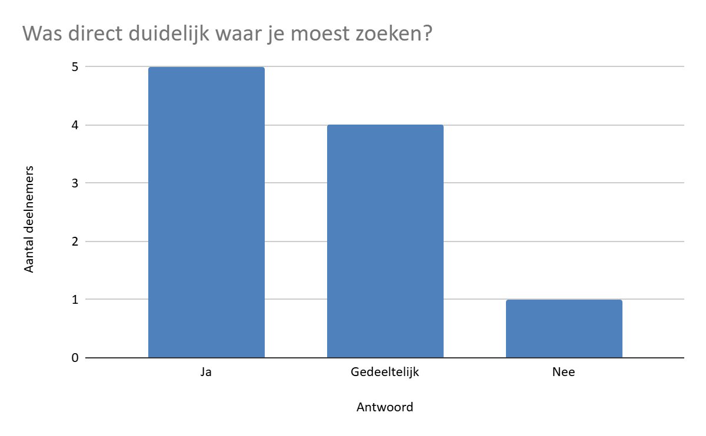
  <figcaption>Inventarisatie van de duidelijkheid over waar gebruikers naar de verwijsbrief moesten zoeken.</figcaption>
</figure>

In hun uitweiding over waar deelnemers hadden verwacht te moeten zoeken werden vooral **Documenten** en **Dossier** genoemd, zie figuur 20.

<figure>
  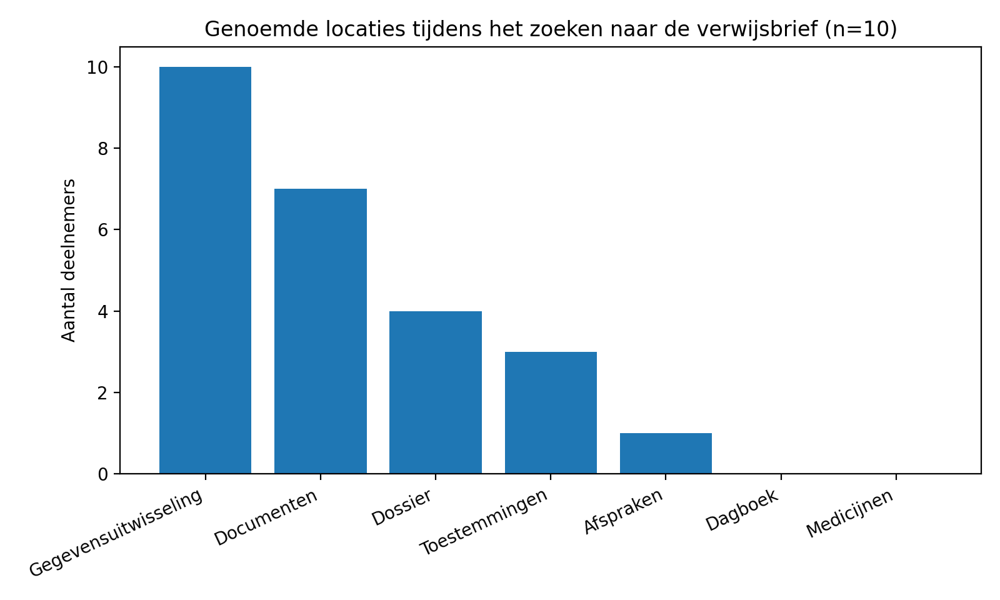
  <figcaption>Aantal keren dat een specifieke locatie werd genoemd tijdens het zoeken naar de verwijsbrief.</figcaption>
</figure>

**Ontvangers, verzenders en betrokken partijen**

Hoewel deelnemers de informatie over de verwijsbrief over het algemeen konden vinden via **Gegevensuitwisseling**, bleek het interpreteren van de informatie minder intuïtief. Meerdere deelnemers twijfelden over welke organisatie de verwijsbrief had gedeeld en welke organisatie deze had ontvangen. De aanwezigheid van meerdere betrokken organisaties, waaronder verschillende huisartspraktijken, en de lijst met **betrokken partijen** maakten dit onderscheid niet direct duidelijk. Hierdoor moesten deelnemers zelf de richting van de gegevensuitwisseling afleiden. Daarnaast gaf een deelnemer aan de voorkeur te hebben voor een documentgericht overzicht, waarin per document direct zichtbaar is wie het heeft gedeeld en wie het heeft ontvangen of ingezien, in plaats van een overzicht dat is gegroepeerd per organisatie.

**Begrip van de applicatie**

**8 van de 10 deelnemers** beschreven correct wat er tijdens de gegevensuitwisseling was gebeurd. Zij benoemden dat zij konden zien welke gegevens worden gedeeld, wanneer deze waren uitgewisseld, met welke zorgverlener of organisatie en om welke documenten het ging. Dit laat zien dat de kernfunctie van de pagina goed wordt begrepen.

#### Meerwaarde van de functie

Alle **10 deelnemers (100%)** gaven aan de functie zelf te willen gebruiken. Daarnaast beoordelen zij de overzichtelijkheid van de pagina gemiddeld met een **5,8 op een schaal van 7**. Dit laat zien dat deelnemers de functionaliteit als waardevol ervaren en behoefte hebben aan inzicht in de uitwisseling van hun medische gegevens.

Deze resultaten sluiten goed aan bij de bevindingen uit de usability test. De vindbaarheid van de functie is goed, terwijl de grootste verbeterkansen liggen in de presentatie en interpretatie van de informatie op de pagina.

**Taalgebruik**

Het taalgebruik werd overwegend als duidelijk ervaren. **9 van de 10 deelnemers** gaven aan dat de gebruikte termen en beschrijvingen begrijpelijk waren en dat de informatie helder was geformuleerd. Wel noemde **1 deelnemer** de term **'verwijsbrief'** als onduidelijk. Ze gaf aan niet direct te weten wat deze term betekende en stelden voor om deze toe te lichten of van een korte uitleg te voorzien. Daarnaast merkte **1 deelnemer** op dat twee termen rondom uitslagen op elkaar leken, waardoor hierover kortstondig verwarring ontstond. Over het algemeen werd het taalgebruik echter als eenvoudig en duidelijk ervaren.

**Vinden van de organisatie**

Vanuit de kwalitatieve analyse wordt het duidelijk dat men via het organisatiescherm makkelijk de groepering van organisaties vindt via een filter. Het is de hypothese dat filteren een complexere interactie is dan het onderdeel maken van de flow. Hier zijn een aantal mogelijke oorzaken voor, zie de onderstaande tabel.

| **Probleem**                                      | **Wat onderzoek laat zien**                                                                                                                                                                                                                                                                                    |
|---------------------------------------------------|------------------------------------------------------------------------------------------------------------------------------------------------------------------------------------------------------------------------------------------------------------------------------------------------------------------|
| **Filters worden niet opgemerkt**                 | Gebruikers richten hun aandacht eerst op de resultatenlijst en zien de filters vaak over het hoofd, vooral wanneer deze boven of naast de resultaten staan. ([<u>usability.de</u>](https://www.usability.de/usability-user-experience/publikationen/faceted-search.html?utm_source=chatgpt.com))               |
| **Onduidelijke terminologie**                     | Filters bevatten vaak jargon of termen die gebruikers niet begrijpen. Hierdoor worden filters verkeerd gebruikt of helemaal genegeerd. ([<u>Baymard Institute</u>](https://baymard.com/blog/use-visual-filters-for-visually-distinct-product-attributes?utm_source=chatgpt.com))                               |
| **Te veel opties**                                | Een lange lijst met filters verhoogt de cognitieve belasting. Gebruikers weten niet waar ze moeten beginnen of welke filters relevant zijn. ([<u>sites.uwm.edu</u>](https://sites.uwm.edu/mdlaug/com-2-nav-1-difficulty-understanding-navigating-the-search-filtering-structure/?utm_source=chatgpt.com))      |
| **Onduidelijke feedback**                         | Gebruikers verwachten direct te zien wat een filter doet. Als niet duidelijk is hoeveel resultaten overblijven of welke filters actief zijn, ontstaat verwarring. ([<u>DWP Design System</u>](https://design-system.dwp.gov.uk/research/filters/design-notes?utm_source=chatgpt.com))                          |
| **Filters sluiten niet aan op het mentale model** | Ontwerpers gebruiken vaak categorieën die logisch zijn voor de organisatie, maar niet voor gebruikers. Daardoor weten gebruikers niet welke filter ze moeten kiezen. ([<u>Baymard Institute</u>](https://baymard.com/blog/use-visual-filters-for-visually-distinct-product-attributes?utm_source=chatgpt.com)) |

## Derde iteratie: final design

In deze derde en laatste iteratie ligt de focus op het definitieve design van de TransparantieApp. Waar de voorgaande cycli zich richtten op het verkennen van het probleem, het definiëren van de persona's en het valideren van verschillende concepten, brengt deze fase alle opgedane inzichten samen tot een samenhangend eindontwerp. In deze sectie worden de resultaten van de laatste validatietesten besproken. Hierbij is specifiek gekeken naar hoe het ontwerp presteert onder diverse gebruikersgroepen—waaronder oudere gebruikers, en hoe de gekozen informatiearchitectuur in de praktijk functioneert. De bevindingen in deze sectie bieden concrete implicaties voor de definitieve inrichting van de applicatie, waarbij de balans tussen transparantie, begrijpelijkheid en intuïtieve navigatie centraal staat.

### Iterate, Define & Realize

Op basis van de resultaten uit eerdere iteraties zijn gerichte verfijningen doorgevoerd in het ontwerp. De focus lag hierbij op het optimaliseren van de labeling van filters, het vergroten van de visuele hiërarchie van de downloadfunctie en het verduidelijken van de terminologie binnen de instellingen. De meest significante ontwerpkeuze in deze fase was de implementatie van een hybride weergave, waarbij de gebruiker flexibel kan schakelen tussen een organisatiegericht overzicht en een chronologische tijdlijn. Deze variant is specifiek getoetst bij een kwetsbare doelgroep om de inclusiviteit en robuustheid van de informatiearchitectuur te valideren.

### Evaluatie: de belangrijkste bevindingen

De evaluatie toont aan dat de bruikbaarheid van het prototype aanzienlijk toeneemt zodra de gebruiker de juiste context bereikt. Een kritiek knelpunt ontstaat echter wanneer het systeem meldingen geeft zoals "Actie niet beschikbaar" of wanneer informatie ontbreekt zonder nadere toelichting. Dit gebrek aan context leidt tot speculatie en wantrouwen bij burgers, waarbij zij vermoeden dat informatie bewust wordt achtergehouden. Om dit te mitigeren, is het essentieel om niet alleen de afwezigheid van data te communiceren, maar ook de achterliggende reden (bijvoorbeeld een organisatie die nog niet is aangesloten) en handelingsperspectief te bieden. Transparantie over het proces is hierbij belangrijker dan de navigatie zelf.

De kern van de informatiearchitectuur, gebaseerd op de relatie tussen organisaties en gegevensuitwisselingen, blijkt conceptueel solide. Deelnemers navigeren op een natuurlijke wijze door de organisatiegerichte weergave en waarderen de flexibiliteit om te schakelen naar een tijdlijn voor recente activiteiten. Deze hybride structuur ondersteunt zowel gerichte zoekstrategieën als algemene oriëntatie, wat bevestigt dat de huidige basis van het ontwerp geen fundamentele herziening behoeft maar enkel verdere verfijning.

Een klassiek usability-probleem kwam naar voren bij het gebruik van filters binnen de tijdlijn. Hoewel de functionaliteit als zeer nuttig wordt ervaren, is de toegang ertoe niet intuïtief genoeg. De term "Tijdlijn" roept soms verwarring op; alternatieven zoals "Overzicht" of "Alle uitwisselingen" sluiten beter aan bij het mentale model van de gebruiker. Bovendien dient de filterfunctie expliciet gelabeld te worden om de vindbaarheid te vergroten, aangezien gebruikers momenteel te veel moeten vertrouwen op visuele herkenning van iconen.

#### Mensen gebruiken verschillende zoekstrategieën

Uit de testresultaten kunnen drie dominante navigatiestrategieën worden afgeleid: navigatie vanuit de organisatie naar detail, een chronologische route via de tijdlijn met filters, en het direct zoeken naar specifieke onderdelen. Een robuust ontwerp moet deze diverse mentale modellen simultaan ondersteunen. In plaats van de gebruiker naar één specifieke route te dwingen, biedt het definitieve design meerdere ingangen naar dezelfde informatie, wat de efficiëntie en gebruikerstevredenheid verhoogt.

1.  Organisatie → gebeurtenis/detail

2.  Tijdlijn → filter → gebeurtenis

3.  Direct zoeken naar het specifieke onderdeel

Een deelnemer wilde bijvoorbeeld expliciet een zoekfunctie gebruiken toen een verwijsbrief niet direct gevonden kon worden. Een andere deelnemer beweegt juist vrij gemakkelijk tussen tijdlijn/filter en organisatieroutes. Weer een andere deelnemer neigt sterker naar navigatie via organisaties. Dat is waardevol, omdat het suggereert dat het product gebruikers niet moet proberen één juiste route aan te leren. Die ene juiste route bestaat waarschijnlijk niet. Een sterker ontwerp zou dezelfde informatie bereikbaar maken via organisatie, tijd/gegevenstype en zoeken.

#### De behoefte aan een volledig en betrouwbaar overzicht

Volledigheid is een kernverwachting van de burger. Meldingen over onvolledige overzichten worden niet slechts als informatief beschouwd, maar raken direct de betrouwbaarheid van de applicatie. Gebruikers wensen de mogelijkheid om ontbrekende organisaties te signaleren of toe te voegen. Het is cruciaal dat de interface een scherp onderscheid maakt tussen verschillende statussen, zoals "geen uitwisseling plaatsgevonden", "organisatie niet aangesloten" of "gegevens tijdelijk niet beschikbaar", om de informatiepositie van de burger te versterken.

#### Contactgegevens van de organisatie

Wanneer onduidelijkheden optreden, is de directe reflex van de gebruiker om contact op te nemen met de bronorganisatie. Het ontwerp faciliteert dit door contactgegevens en directe links naar externe websites van organisaties integraal op te nemen in de gegevensdetails. Dit voorkomt dat burgers zelfstandig op zoek moeten naar contactinformatie en versterkt het handelingsperspectief binnen de applicatie.

#### De downloadfunctie werkt, maar valt visueel niet altijd genoeg op

De downloadfunctie wordt gewaardeerd, maar de visuele hiërarchie van de knop behoeft verbetering. Sommige deelnemers zochten naar downloadopties bij individuele gebeurtenissen in plaats van het totaaloverzicht. Hoewel de flow als logisch wordt ervaren, moet de knop prominenter gepositioneerd worden om de vindbaarheid voor alle gebruikersgroepen te garanderen.

#### Aannames over het gebruikte apparaat verdienen aandacht

De testomgeving bracht relevante inzichten naar voren over de gebruikscontext. Er is een duidelijke voorkeur voor grotere schermen (desktop of tablet) bij het raadplegen van complexe medische of juridische data, vooral onder oudere gebruikers. Een responsief ontwerp dat geoptimaliseerd is voor diverse apparaten en browsers is derhalve geen secundaire vereiste, maar een voorwaarde voor een inclusieve en toegankelijke dienstverlening. Veel ouderen gebruiken Apple producten, dus zou het design idealiter voor deze webbrowser geoptimaliseerd zijn.

#### Overzicht belangrijkste onderzoeksbevindingen

| **Prioriteit** | **Bevinding**                                                                                     | **Ontwerprichting**                                                                      |
|----------------|-----------------------------------------------------------------------------------------------------|--------------------------------------------------------------------------------------------|
| Kritiek        | Ontbrekende of niet-beschikbare informatie veroorzaakt onzekerheid en soms wantrouwen             | Leg uit waarom, wat het betekent en wat de gebruiker vervolgens kan doen                 |
| Hoog           | Gebruikers ontdekken niet altijd wat de tijdlijn en filters kunnen                                | Verbeter terminologie en maak filteren explicieter                                       |
| Hoog           | Gebruikers willen weten of het overzicht daadwerkelijk volledig is                                | Leg uit wat wel en niet wordt meegenomen, inclusief ontbrekende organisaties en gegevens |
| Hoog           | Gebruikers verwachten een route van transparantie naar actie                                      | Bied contactgegevens, een organisatie website of een andere logische vervolgstap         |
| Middel         | Verschillende gebruikers hanteren verschillende mentale modellen: organisatie, tijdlijn en zoeken | Ondersteun meerdere routes naar dezelfde informatie                                      |
| Middel/Laag    | Downloaden is nuttig, maar kan visueel over het hoofd worden gezien                               | Maak de downloadknop prominenter                                                         |

### Verbeterpunten en iteratieve acties

Op basis van deze bevindingen zijn de volgende verbeteringen doorgevoerd of aanbevolen:

- **Transparantie over ontbrekende data:** Communiceer duidelijk waarom informatie ontbreekt (bijvoorbeeld 'organisatie niet aangesloten' in plaats van 'niet beschikbaar') en bied een handelingsperspectief.

- **Labeling en vindbaarheid:** Hernoem 'Tijdlijn' naar 'Overzicht' of 'Alle uitwisselingen' voor betere herkenbaarheid en label de filterfunctie expliciet als 'Filter'.

- **UI/UX optimalisatie:** Vergroot de zichtbaarheid van de downloadknop en zorg voor een robuuste responsieve weergave voor tablets en desktops, aangezien dit een sterke voorkeur genoot.

- **Handelingsperspectief:** Bied bij onduidelijkheden direct contactgegevens of een verwijzing naar de website van de betreffende organisatie aan.
